75 creatures with an authored spawn. Each one has its own page with a spawn map, combat stats, and drops.

## Tier 1

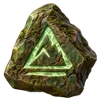Tier 1<a class="codex-card__link" href="./briar_harrow_t1/">Briar Harrow</a>Farmland6 HPMax hit 1Territorial

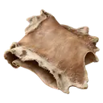Tier 1<a class="codex-card__link" href="./cattle_t1/">Cow</a>Farmland16 HPMax hit 5Territorial

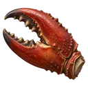Tier 1<a class="codex-card__link" href="./creek_crab_t1/">Creek Crab</a>Farmland10 HPMax hit 2Territorial

Tier 1<a class="codex-card__link" href="./fen_crawler_t1/">Fen Crawler</a>Farmland3 HPMax hit 1Aggressive

Tier 1<a class="codex-card__link" href="./frog_t1/">Frog</a>Farmland6 HPMax hit 2Passive

Tier 1<a class="codex-card__link" href="./goat_t1/">Goat</a>Farmland12 HPMax hit 3Aggressive

Tier 1<a class="codex-card__link" href="./reedbank_goose_t1/">Goose</a>Farmland10 HPMax hit 3Territorial

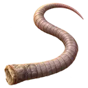Tier 1<a class="codex-card__link" href="./granary_rat_t1/">Granary Rat</a>Farmland6 HPMax hit 2Passive

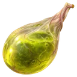Tier 1<a class="codex-card__link" href="./grass_viper_t1/">Grass Viper</a>Farmland8 HPMax hit 2Territorial

Tier 1<a class="codex-card__link" href="./heath_jack_t1/">Heath Jack</a>Farmland2 HPMax hit 1Aggressive

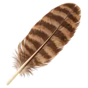Tier 1<a class="codex-card__link" href="./hen_t1/">Hen</a>Farmland4 HPMax hit 1Passive

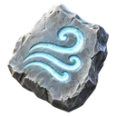Tier 1<a class="codex-card__link" href="./galeskin_t1/">Plains Ogre</a>Farmland52 HPMax hit 5Territorial

Tier 1<a class="codex-card__link" href="./coney_t1/">Rabbit</a>Farmland5 HPMax hit 1Passive

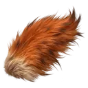Tier 1<a class="codex-card__link" href="./redbrush_fox_t1/">Red Fox</a>Farmland8 HPMax hit 2Passive

Tier 1<a class="codex-card__link" href="./reed_strider_t1/">Reed Strider</a>Farmland2 HPMax hit 1Territorial

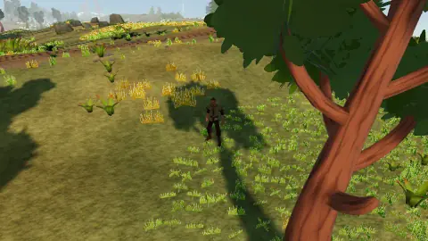Tier 1<a class="codex-card__link" href="./reaver_t1/">Road Bandit</a>Farmland9 HPMax hit 3Aggressive

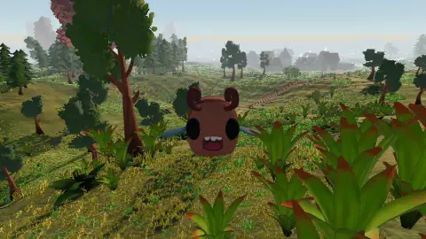Tier 1<a class="codex-card__link" href="./tempest_roc_t1/">Storm Scarab</a>Farmland72 HPMax hit 5Territorial

Tier 1<a class="codex-card__link" href="./thorn_maw_t1/">Thorn Maw</a>Farmland6 HPMax hit 1Aggressive

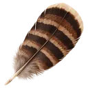Tier 1<a class="codex-card__link" href="./marchfield_turkey_t1/">Turkey</a>Farmland7 HPMax hit 2Passive

## Tier 5

Tier 5<a class="codex-card__link" href="./blind_cave_weaver_t5/">Blind Cave Weaver</a>Stone Cavern15 HPMax hit 2Aggressive

Tier 5<a class="codex-card__link" href="./briar_harrow_t5/">Briar Harrow</a>Farmland · Woodlands32 HPMax hit 5Territorial

Tier 5<a class="codex-card__link" href="./fen_crawler_t5/">Fen Crawler</a>Woodlands13 HPMax hit 2Aggressive

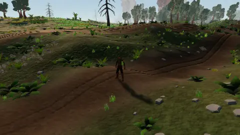Tier 5<a class="codex-card__link" href="./reaver_t5/">Forest Bandit</a>Woodlands26 HPMax hit 6Aggressive

Tier 5<a class="codex-card__link" href="./mossbound_t5/">Forest Ogre</a>Woodlands67 HPMax hit 6Territorial

Tier 5<a class="codex-card__link" href="./heath_jack_t5/">Heath Jack</a>Woodlands12 HPMax hit 1Aggressive

Tier 5<a class="codex-card__link" href="./reed_strider_t5/">Reed Strider</a>Woodlands11 HPMax hit 2Territorial

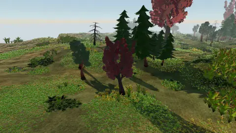Tier 5<a class="codex-card__link" href="./rootheart_t5/">Rootbound Colossus</a>Woodlands125 HPMax hit 8Territorial

Tier 5<a class="codex-card__link" href="./thorn_maw_t5/">Thorn Maw</a>Woodlands28 HPMax hit 3Aggressive

## Tier 10

Tier 10<a class="codex-card__link" href="./blind_cave_weaver_t10/">Blind Cave Weaver</a>Highlands · Stone Cavern30 HPMax hit 3Aggressive

Tier 10<a class="codex-card__link" href="./briar_harrow_t10/">Briar Harrow</a>Woodlands64 HPMax hit 9Territorial

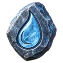Tier 10<a class="codex-card__link" href="./cairn_treader_t10/">Cairn Treader</a>Highlands52 HPMax hit 6Territorial

Tier 10<a class="codex-card__link" href="./tideworn_t10/">Cave Ogre</a>Highlands189 HPMax hit 11Territorial

Tier 10<a class="codex-card__link" href="./flint_mandible_t10/">Flint Mandible</a>Highlands · Stone Cavern46 HPMax hit 6Territorial

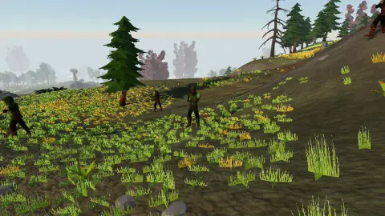Tier 10<a class="codex-card__link" href="./reaver_t10/">Highland Bandit</a>Highlands · Stone Cavern40 HPMax hit 7Aggressive

Tier 10<a class="codex-card__link" href="./quarrykeeper_t10/">Quarry Warden</a>Stone Cavern258 HPMax hit 14Territorial

Tier 10<a class="codex-card__link" href="./scree_watcher_t10/">Scree Watcher</a>Highlands40 HPMax hit 6Territorial

Tier 10<a class="codex-card__link" href="./vault_custodian_t10/">Vault Custodian</a>Highlands · Stone Cavern64 HPMax hit 10Aggressive

## Tier 20

Tier 20<a class="codex-card__link" href="./grave_lantern_t20/">Ashen Ghoul</a>Ashlands46 HPMax hit 6Aggressive

Tier 20<a class="codex-card__link" href="./cinder_penitent_t20/">Cinder Penitent</a>Ashlands52 HPMax hit 10Aggressive

Tier 20<a class="codex-card__link" href="./cinderwake_t20/">Fire Ogre</a>Ashlands394 HPMax hit 20Territorial

Tier 20<a class="codex-card__link" href="./kiln_marrow_t20/">Kiln Marrow</a>Ashlands74 HPMax hit 9Territorial

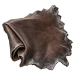Tier 20<a class="codex-card__link" href="./reaver_t20/">Quarry Bandit</a>Ashlands58 HPMax hit 10Aggressive

Tier 20<a class="codex-card__link" href="./slag_crawler_t20/">Slag Crawler</a>Ashlands76 HPMax hit 6Aggressive

Tier 20<a class="codex-card__link" href="./veil_reaper_t20/">Veil Reaper</a>Ashlands58 HPMax hit 10Aggressive

## Tier 50

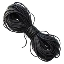Tier 50<a class="codex-card__link" href="./grave_lantern_t50/">Ashen Ghoul</a>Wilderness166 HPMax hit 14Aggressive

Tier 50<a class="codex-card__link" href="./ashseal_warden_t50/">Ashseal Warden</a>Wilderness710 HPMax hit 37Territorial

Tier 50<a class="codex-card__link" href="./banshee_t50/">Banshee</a>Wilderness88 HPMax hit 16Aggressive

Tier 50<a class="codex-card__link" href="./basalt_maw_t50/">Basalt Maw</a>Wilderness179 HPMax hit 21Aggressive

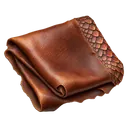Tier 50<a class="codex-card__link" href="./baby_black_dragon_t50/">Black Dragon Hatchling</a>Wilderness145 HPMax hit 16Aggressive

Tier 50<a class="codex-card__link" href="./baby_lava_dragon_t50/">Cinder Dreadwing</a>Wilderness159 HPMax hit 16Aggressive

Tier 50<a class="codex-card__link" href="./cinder_penitent_t50/">Cinder Penitent</a>Wilderness108 HPMax hit 16Aggressive

Tier 50<a class="codex-card__link" href="./cinderback_crag_t50/">Cinderback Crag</a>Wilderness156 HPMax hit 21Aggressive

Tier 50<a class="codex-card__link" href="./furnace_grazer_t50/">Furnace Grazer</a>Wilderness248 HPMax hit 24Territorial

Tier 50<a class="codex-card__link" href="./furnace_regent_t50/">Furnace Regent</a>Wilderness953 HPMax hit 37Territorial

Tier 50<a class="codex-card__link" href="./grave_ghoul_t50/">Grave Ghoul</a>Wilderness119 HPMax hit 15Aggressive

Tier 50<a class="codex-card__link" href="./hollow_bough_t50/">Hollow Bough</a>Wilderness192 HPMax hit 18Aggressive

Tier 50<a class="codex-card__link" href="./kiln_marrow_t50/">Kiln Marrow</a>Wilderness202 HPMax hit 18Territorial

Tier 50<a class="codex-card__link" href="./pallid_shade_t50/">Pallid Shade</a>Wilderness114 HPMax hit 14Aggressive

Tier 50<a class="codex-card__link" href="./baby_red_dragon_t50/">Red Dragon Hatchling</a>Wilderness135 HPMax hit 15Aggressive

Tier 50<a class="codex-card__link" href="./revenant_t50/">Revenant</a>Wilderness118 HPMax hit 16Aggressive

Tier 50<a class="codex-card__link" href="./skeleton_archer_t50/">Skeleton Archer</a>Wilderness129 HPMax hit 11Aggressive

Tier 50<a class="codex-card__link" href="./skeleton_mage_t50/">Skeleton Mage</a>Wilderness88 HPMax hit 16Aggressive

Tier 50<a class="codex-card__link" href="./skeleton_soldier_t50/">Skeleton Soldier</a>Wilderness130 HPMax hit 11Aggressive

Tier 50<a class="codex-card__link" href="./veil_reaper_t50/">Veil Reaper</a>Wilderness109 HPMax hit 16Aggressive

Tier 50<a class="codex-card__link" href="./wraith_t50/">Wraith</a>Wilderness92 HPMax hit 15Aggressive

## Tier 70

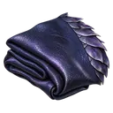Tier 70<a class="codex-card__link" href="./black_wilderness_dragon_t70/">Black Wilderness Dragon</a>Wilderness209 HPMax hit 22Aggressive

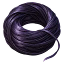Tier 70<a class="codex-card__link" href="./chainbound_archon_t70/">Chainbound Archon</a>Wilderness922 HPMax hit 48Territorial

Tier 70<a class="codex-card__link" href="./gloam_wraith_t70/">Gloam Wraith</a>Wilderness229 HPMax hit 29Aggressive

Tier 70<a class="codex-card__link" href="./nightforge_marshal_t70/">Nightforge Marshal</a>Wilderness1311 HPMax hit 51Territorial

Tier 70<a class="codex-card__link" href="./amethyst_dragon_t70/">Purple Wilderness Dragon</a>Wilderness212 HPMax hit 22Aggressive

Tier 70<a class="codex-card__link" href="./red_wilderness_dragon_t70/">Red Wilderness Dragon</a>Wilderness200 HPMax hit 21Aggressive

Tier 70<a class="codex-card__link" href="./rift_carapace_t70/">Rift Carapace</a>Wilderness227 HPMax hit 29Aggressive

Tier 70<a class="codex-card__link" href="./hollow_star_t70/">The Hollow Star</a>Wilderness1531 HPMax hit 48Territorial

Tier 70<a class="codex-card__link" href="./purple_wilderness_dragon_t70/">Violet Dreadwing</a>Wilderness212 HPMax hit 22Aggressive

Tier 70<a class="codex-card__link" href="./voidstone_colossus_t70/">Voidstone Colossus</a>Wilderness356 HPMax hit 32Territorial

