300 items from the live game catalog. Hover an icon or focus it with the keyboard for the in-game item card.

## Tier 0

<a class="corealm-item-tile" id="basic-wooden-staff" data-item-id="basic_wooden_staff" href="./basic_wooden_staff/" aria-label="Basic Wooden Staff" aria-describedby="item-tooltip-basic_wooden_staff">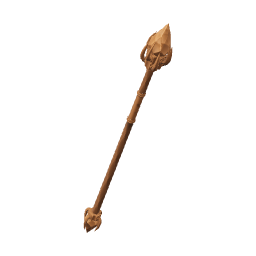Basic Wooden StaffTier 0 · equipmentBasic Wooden StaffequipmentA plain two-handed staff with an empty brown socket and no glow of its own.Magic accuracy+3Magic power+7Cast cadence 3.0 sStaff: two-handed, slower casts, stronger hits.Value 20 · sells for 12</a>
<a class="corealm-item-tile" id="basic-wooden-wand" data-item-id="basic_wooden_wand" href="./basic_wooden_wand/" aria-label="Basic Wooden Wand" aria-describedby="item-tooltip-basic_wooden_wand">Basic Wooden WandTier 0 · equipmentBasic Wooden WandequipmentPlain brown wood from grip to socket, with no light or elemental charge.Magic accuracy+2Magic power+1Cast cadence 2.2 sWand: one-handed, faster casts, weaker hits.Value 12 · sells for 7</a>
<a class="corealm-item-tile" id="worn-shortsword" data-item-id="worn_sword" href="./worn_sword/" aria-label="Worn Shortsword" aria-describedby="item-tooltip-worn_sword">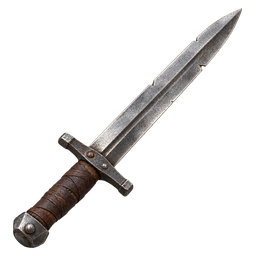Worn ShortswordTier 0 · equipmentWorn ShortswordequipmentNotched, re-hafted twice, and lighter than it looks. It was somebody else's first.Accuracy+3Power+3Attack speed 2.4 sValue 15 · sells for 9</a>
<a class="corealm-item-tile" id="worn-hatchet" data-item-id="worn_hatchet" href="./worn_hatchet/" aria-label="Worn Hatchet" aria-describedby="item-tooltip-worn_hatchet">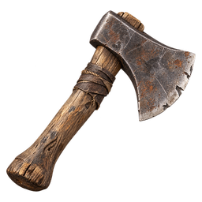Worn HatchetTier 0 · toolWorn HatchettoolMore wedge than edge. It will get through pine if you are patient.Woodcutting tool, +1 effective levels.Value 8 · sells for 5</a>
<a class="corealm-item-tile" id="worn-pickaxe" data-item-id="worn_pickaxe" href="./worn_pickaxe/" aria-label="Worn Pickaxe" aria-describedby="item-tooltip-worn_pickaxe">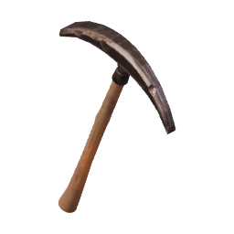Worn PickaxeTier 0 · toolWorn PickaxetoolThe head is loose and the haft is somebody's fence post. One effective Mining level.Mining tool, +1 effective levels.Value 8 · sells for 5</a>
<a class="corealm-item-tile" id="worn-rod" data-item-id="worn_rod" href="./worn_rod/" aria-label="Worn Rod" aria-describedby="item-tooltip-worn_rod">Worn RodTier 0 · toolWorn RodtoolA green stick and a length of gut. One effective Fishing level, on a good day.Fishing tool, +1 effective levels.Value 6 · sells for 4</a>

## Tier 1

<a class="corealm-item-tile" id="copper-bar" data-item-id="grithe_bar" href="./grithe_bar/" aria-label="Copper Bar" aria-describedby="item-tooltip-grithe_bar">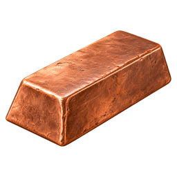Copper BarTier 1 · barCopper BarbarOne ore, one stone, one bar. The first thing anybody makes.Value 30 · sells for 18</a>
<a class="corealm-item-tile" id="air-orb" data-item-id="air_orb" href="./air_orb/" aria-label="Air Orb" aria-describedby="item-tooltip-air_orb">Air OrbTier 1 · componentAir OrbcomponentA region-boss core used to craft a charged Air wand or staff.Craft this into an Air wand or staff. The finished weapon starts with 1,000 charges.Value 0 · sells for 0</a>
<a class="corealm-item-tile" id="coarse-hide" data-item-id="coarse_hide" href="./coarse_hide/" aria-label="Coarse Hide" aria-describedby="item-tooltip-coarse_hide">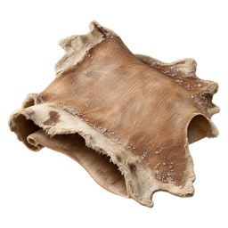Coarse HideTier 1 · componentCoarse HidecomponentGoat and rabbit skins, scraped and salted together. Stiff until you work it.Value 16 · sells for 10</a>
<a class="corealm-item-tile" id="curled-horn" data-item-id="curl_horn" href="./curl_horn/" aria-label="Curled Horn" aria-describedby="item-tooltip-curl_horn">Curled HornTier 1 · componentCurled HorncomponentOne horn from a goat. Hollow, and loud if you know how to blow it.Value 22 · sells for 13</a>
<a class="corealm-item-tile" id="fox-fur" data-item-id="fox_guardhair" href="./fox_guardhair/" aria-label="Fox Fur" aria-describedby="item-tooltip-fox_guardhair">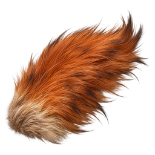Fox FurTier 1 · componentFox Furcomponent · stacksCoarse red hair from a fox's back. Bind it around a Copper band for a padded guard ring.Value 3 · sells for 2</a>
<a class="corealm-item-tile" id="goose-down" data-item-id="goose_down" href="./goose_down/" aria-label="Goose Down" aria-describedby="item-tooltip-goose_down">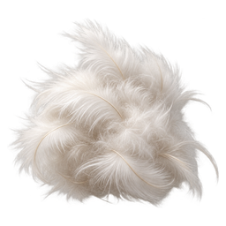Goose DownTier 1 · componentGoose Downcomponent · stacksSoft breast feathers. Pack them between hide panels to finish a robe with less leather.Value 3 · sells for 2</a>
<a class="corealm-item-tile" id="hen-egg" data-item-id="hen_egg" href="./hen_egg/" aria-label="Hen Egg" aria-describedby="item-tooltip-hen_egg">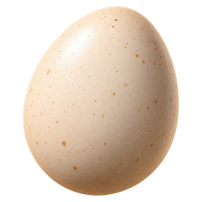Hen EggTier 1 · componentHen Eggcomponent · stacksWarm when you find it, which is how you know you were quick enough.Value 6 · sells for 4</a>
<a class="corealm-item-tile" id="hen-feather" data-item-id="hen_feather" href="./hen_feather/" aria-label="Hen Feather" aria-describedby="item-tooltip-hen_feather">Hen FeatherTier 1 · componentHen Feathercomponent · stacksBarred brown, still stiff at the quill. Fletchers buy them by the double handful.Value 3 · sells for 2</a>
<a class="corealm-item-tile" id="marsh-gland" data-item-id="marsh_gland" href="./marsh_gland/" aria-label="Marsh Gland" aria-describedby="item-tooltip-marsh_gland">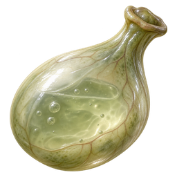Marsh GlandTier 1 · componentMarsh Glandcomponent · stacksPale sac from behind a frog's jaw. Keeps essence wet, which is most of the trick.Value 15 · sells for 9</a>
<a class="corealm-item-tile" id="ox-horn" data-item-id="ox_horn" href="./ox_horn/" aria-label="Ox Horn" aria-describedby="item-tooltip-ox_horn">Ox HornTier 1 · componentOx HorncomponentShort, thick and scarred at the base. Millfield turns them into cups and lamp horn.Value 26 · sells for 16</a>
<a class="corealm-item-tile" id="pine-handle" data-item-id="palewood_handle" href="./palewood_handle/" aria-label="Pine Handle" aria-describedby="item-tooltip-palewood_handle">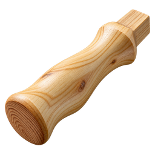Pine HandleTier 1 · componentPine Handlecomponent · stacksA short pine grip, shaped for a Copper tang or tool head.Value 6 · sells for 4</a>
<a class="corealm-item-tile" id="pine-shaft" data-item-id="palewood_shaft" href="./palewood_shaft/" aria-label="Pine Shaft" aria-describedby="item-tooltip-palewood_shaft">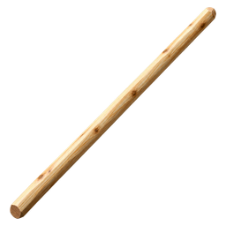Pine ShaftTier 1 · componentPine Shaftcomponent · stacksA shaved length of pine. Handle, haft, or half a staff.Value 4 · sells for 2</a>
<a class="corealm-item-tile" id="quartz" data-item-id="pale_quartz" href="./pale_quartz/" aria-label="Quartz" aria-describedby="item-tooltip-pale_quartz">QuartzTier 1 · componentQuartzcomponent · stacksA milky chip out of a Copper seam. Holds a charge just long enough to be useful.Value 20 · sells for 12</a>
<a class="corealm-item-tile" id="rabbit-foot" data-item-id="coney_foot" href="./coney_foot/" aria-label="Rabbit Foot" aria-describedby="item-tooltip-coney_foot">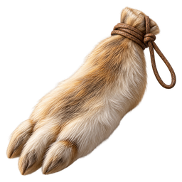Rabbit FootTier 1 · componentRabbit Footcomponent · stacksCarried for luck by everyone who has ever admitted the moor frightens them.Value 18 · sells for 11</a>
<a class="corealm-item-tile" id="turkey-tail-feather" data-item-id="turkey_tailfeather" href="./turkey_tailfeather/" aria-label="Turkey Tail Feather" aria-describedby="item-tooltip-turkey_tailfeather">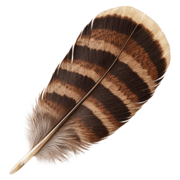Turkey Tail FeatherTier 1 · componentTurkey Tail Feathercomponent · stacksA barred tail feather. Millfield hunters bind a fan of them around a small warding charm.Value 3 · sells for 2</a>
<a class="corealm-item-tile" id="viper-skin" data-item-id="viper_skin" href="./viper_skin/" aria-label="Viper Skin" aria-describedby="item-tooltip-viper_skin">Viper SkinTier 1 · componentViper SkincomponentShed whole and inside out. Copper fletchers back their nocks with it.Value 24 · sells for 14</a>
<a class="corealm-item-tile" id="marks" data-item-id="marks" href="./marks/" aria-label="Marks" aria-describedby="item-tooltip-marks">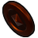MarksTier 1 · currencyMarkscurrency · stacksStamped Trade Company scrip. Every settlement between here and the moor takes it.Value 1 · sells for 1</a>
<a class="corealm-item-tile" id="air-staff" data-item-id="air_staff" href="./air_staff/" aria-label="Air Staff" aria-describedby="item-tooltip-air_staff">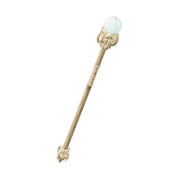Air StaffTier 1 · equipmentAir StaffequipmentPine Staff fitted with a Air Orb. Its charge pays for matching spells before carried Essence.Magic accuracy+7Magic power+8Magic armour+3Cast cadence 3.0 sStaff: two-handed, slower casts, stronger hits.Air weapon · 1,000 charge capacity.100 Air Essence at an Essence Altar refills it.Requires Magic 1Value 140 · sells for 84</a>
<a class="corealm-item-tile" id="air-wand" data-item-id="air_wand" href="./air_wand/" aria-label="Air Wand" aria-describedby="item-tooltip-air_wand">Air WandTier 1 · equipmentAir WandequipmentPine Wand fitted with a Air Orb. Its charge pays for matching spells before carried Essence.Magic accuracy+5Magic power+4Magic armour+2Cast cadence 2.2 sWand: one-handed, faster casts, weaker hits.Air weapon · 1,000 charge capacity.100 Air Essence at an Essence Altar refills it.Requires Magic 1Value 95 · sells for 57</a>
<a class="corealm-item-tile" id="copper-boots" data-item-id="grithe_boots" href="./grithe_boots/" aria-label="Copper Boots" aria-describedby="item-tooltip-grithe_boots">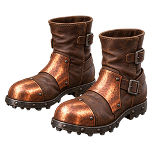Copper BootsTier 1 · equipmentCopper BootsequipmentIron-shod boots for scree and bracken.Armour+1Vitality+1Requires Melee 1Value 80 · sells for 48</a>
<a class="corealm-item-tile" id="copper-cuirass" data-item-id="grithe_cuirass" href="./grithe_cuirass/" aria-label="Copper Cuirass" aria-describedby="item-tooltip-grithe_cuirass">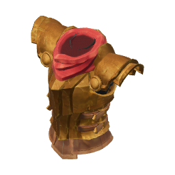Copper CuirassTier 1 · equipmentCopper CuirassequipmentA plate front laced over a leather back. Cheap, loud, and better than nothing.Accuracy+1Armour+5Magic armour+1Vitality+2Requires Melee 1Value 220 · sells for 132</a>
<a class="corealm-item-tile" id="copper-dagger" data-item-id="grithe_dagger" href="./grithe_dagger/" aria-label="Copper Dagger" aria-describedby="item-tooltip-grithe_dagger">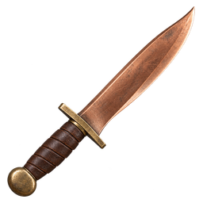Copper DaggerTier 1 · equipmentCopper DaggerequipmentA short blade of dull grey Copper. The first real weapon anyone out here owns.Accuracy+6Power+6Attack speed 2.4 sRequires Melee 1Value 90 · sells for 54</a>
<a class="corealm-item-tile" id="copper-gloves" data-item-id="grithe_gloves" href="./grithe_gloves/" aria-label="Copper Gloves" aria-describedby="item-tooltip-grithe_gloves">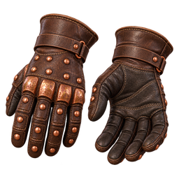Copper GlovesTier 1 · equipmentCopper GlovesequipmentStudded gloves. They keep the grip when the haft goes wet.Armour+1Vitality+1Requires Melee 1Value 80 · sells for 48</a>
<a class="corealm-item-tile" id="copper-greaves" data-item-id="grithe_greaves" href="./grithe_greaves/" aria-label="Copper Greaves" aria-describedby="item-tooltip-grithe_greaves">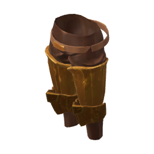Copper GreavesTier 1 · equipmentCopper GreavesequipmentShin and thigh plates on a march-issue belt.Armour+3Magic armour+1Vitality+1Requires Melee 1Value 200 · sells for 120</a>
<a class="corealm-item-tile" id="copper-helm" data-item-id="grithe_helm" href="./grithe_helm/" aria-label="Copper Helm" aria-describedby="item-tooltip-grithe_helm">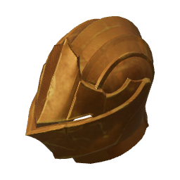Copper HelmTier 1 · equipmentCopper HelmequipmentAn open-faced cap. You can hear things coming, which is most of the job.Armour+2Vitality+1Requires Melee 1Value 110 · sells for 66</a>
<a class="corealm-item-tile" id="copper-pendant" data-item-id="grithe_pendant" href="./grithe_pendant/" aria-label="Copper Pendant" aria-describedby="item-tooltip-grithe_pendant">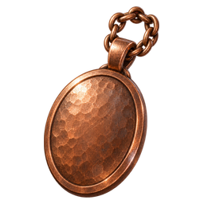Copper PendantTier 1 · equipmentCopper PendantequipmentTrade Company issue. The stamp on the back is a serial number, not a blessing.Accuracy+1Magic armour+1Requires Melee 1Value 105 · sells for 63</a>
<a class="corealm-item-tile" id="copper-ring" data-item-id="grithe_ring" href="./grithe_ring/" aria-label="Copper Ring" aria-describedby="item-tooltip-grithe_ring">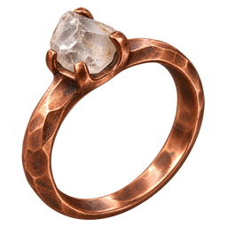Copper RingTier 1 · equipmentCopper RingequipmentA plain band set with a chip of quartz.Accuracy+1Requires Melee 1Value 95 · sells for 57</a>
<a class="corealm-item-tile" id="copper-sword" data-item-id="grithe_sword" href="./grithe_sword/" aria-label="Copper Sword" aria-describedby="item-tooltip-grithe_sword">Copper SwordTier 1 · equipmentCopper SwordequipmentTwo bars of Copper beaten flat and given an edge. Heavier than the dagger, and hits like it.Accuracy+7Power+8Attack speed 2.4 sRequires Melee 1Value 180 · sells for 108</a>
<a class="corealm-item-tile" id="ember-charm" data-item-id="ember_charm" href="./ember_charm/" aria-label="Ember Charm" aria-describedby="item-tooltip-ember_charm">Ember CharmTier 1 · equipmentEmber CharmequipmentA quartz bead on a wire loop, scorched black at one end.Magic accuracy+1Magic armour+1Requires Magic 1Value 105 · sells for 63</a>
<a class="corealm-item-tile" id="ember-ring" data-item-id="ember_ring" href="./ember_ring/" aria-label="Ember Ring" aria-describedby="item-tooltip-ember_ring">Ember RingTier 1 · equipmentEmber RingequipmentWarm to the touch. Emberlash comes a little easier wearing it.Magic accuracy+1Requires Magic 1Value 95 · sells for 57</a>
<a class="corealm-item-tile" id="fox-fur-ring" data-item-id="foxhair_ring" href="./foxhair_ring/" aria-label="Fox Fur Ring" aria-describedby="item-tooltip-foxhair_ring">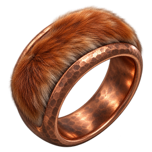Fox Fur RingTier 1 · equipmentFox Fur RingequipmentA Copper band padded with red guardhair. Protects the hand; adds no accuracy.Armour+1Requires Melee 1Value 95 · sells for 57</a>
<a class="corealm-item-tile" id="hide-boots" data-item-id="marchhide_boots" href="./marchhide_boots/" aria-label="Hide Boots" aria-describedby="item-tooltip-marchhide_boots">Hide BootsTier 1 · equipmentHide BootsequipmentSoft-soled. Quiet, which matters more than it sounds.Magic armour+1Requires Magic 1Value 65 · sells for 39</a>
<a class="corealm-item-tile" id="hide-hood" data-item-id="marchhide_hood" href="./marchhide_hood/" aria-label="Hide Hood" aria-describedby="item-tooltip-marchhide_hood">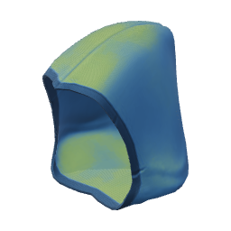Hide HoodTier 1 · equipmentHide HoodequipmentCured wolf hide, hood up against the march wind.Armour+1Magic accuracy+1Magic armour+2Vitality+1Requires Magic 1Value 90 · sells for 54</a>
<a class="corealm-item-tile" id="hide-leggings" data-item-id="marchhide_leggings" href="./marchhide_leggings/" aria-label="Hide Leggings" aria-describedby="item-tooltip-marchhide_leggings">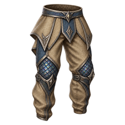Hide LeggingsTier 1 · equipmentHide LeggingsequipmentHide leggings, laced at the calf.Armour+1Magic accuracy+1Magic armour+2Vitality+1Requires Magic 1Value 150 · sells for 90</a>
<a class="corealm-item-tile" id="hide-robe" data-item-id="marchhide_robe" href="./marchhide_robe/" aria-label="Hide Robe" aria-describedby="item-tooltip-marchhide_robe">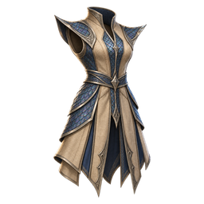Hide RobeTier 1 · equipmentHide RobeequipmentThree hides stitched into something between a coat and a tent.Armour+1Magic accuracy+1Magic power+1Magic armour+3Vitality+2Requires Magic 1Value 170 · sells for 102</a>
<a class="corealm-item-tile" id="hide-wraps" data-item-id="marchhide_wraps" href="./marchhide_wraps/" aria-label="Hide Wraps" aria-describedby="item-tooltip-marchhide_wraps">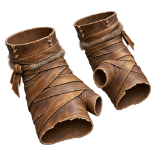Hide WrapsTier 1 · equipmentHide WrapsequipmentHide strips wound to the knuckle, fingertips left bare.Magic armour+1Requires Magic 1Value 65 · sells for 39</a>
<a class="corealm-item-tile" id="pine-shield" data-item-id="palewood_shield" href="./palewood_shield/" aria-label="Pine Shield" aria-describedby="item-tooltip-palewood_shield">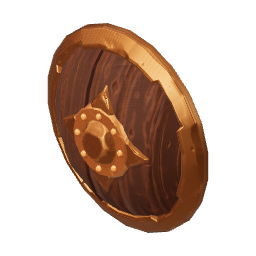Pine ShieldTier 1 · equipmentPine ShieldequipmentPlanks of pale march wood banded at the rim. It stops a claw once.Accuracy+1Armour+4Magic armour+2Requires Melee 1Value 70 · sells for 42</a>
<a class="corealm-item-tile" id="pine-staff" data-item-id="palewood_staff" href="./palewood_staff/" aria-label="Pine Staff" aria-describedby="item-tooltip-palewood_staff">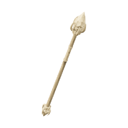Pine StaffTier 1 · equipmentPine StaffequipmentA pale two-handed shaft with an empty socket. The wood itself gives off no light.Magic accuracy+6Magic power+7Magic armour+1Cast cadence 3.0 sStaff: two-handed, slower casts, stronger hits.Requires Magic 1Value 140 · sells for 84</a>
<a class="corealm-item-tile" id="pine-wand" data-item-id="palewood_wand" href="./palewood_wand/" aria-label="Pine Wand" aria-describedby="item-tooltip-palewood_wand">Pine WandTier 1 · equipmentPine WandequipmentPale wood with an empty socket at the tip. It stays unlit until upgraded.Magic accuracy+4Magic power+3Cast cadence 2.2 sWand: one-handed, faster casts, weaker hits.Requires Magic 1Value 95 · sells for 57</a>
<a class="corealm-item-tile" id="plains-ogre-staff" data-item-id="galeskin_staff" href="./galeskin_staff/" aria-label="Plains Ogre Staff" aria-describedby="item-tooltip-galeskin_staff">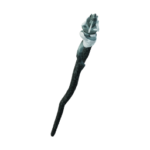Plains Ogre StaffTier 1 · equipmentPlains Ogre StaffequipmentPine scoured silver by wind. The empty socket hums in weather.Magic accuracy+7Magic power+8Magic armour+1Cast cadence 3.0 sStaff: two-handed, slower casts, stronger hits.Requires Magic 1Value 210 · sells for 126</a>
<a class="corealm-item-tile" id="plains-ogre-sword" data-item-id="galeskin_sword" href="./galeskin_sword/" aria-label="Plains Ogre Sword" aria-describedby="item-tooltip-galeskin_sword">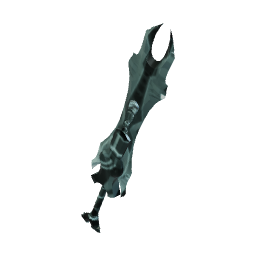Plains Ogre SwordTier 1 · equipmentPlains Ogre SwordequipmentCopper pattern, but the edge whistles on the backswing. Plains Ogre carried it point-down.Accuracy+8Power+9Attack speed 2.4 sRequires Melee 1Value 270 · sells for 162</a>
<a class="corealm-item-tile" id="turkey-plume-charm" data-item-id="turkey_plume_charm" href="./turkey_plume_charm/" aria-label="Turkey Plume Charm" aria-describedby="item-tooltip-turkey_plume_charm">Turkey Plume CharmTier 1 · equipmentTurkey Plume CharmequipmentA quartz charm wrapped in barred feathers. Trades a caster's focus for endurance.Armour+1Vitality+1Requires Melee 1Value 105 · sells for 63</a>
<a class="corealm-item-tile" id="burnt-game" data-item-id="burnt_game" href="./burnt_game/" aria-label="Burnt Game" aria-describedby="item-tooltip-burnt_game">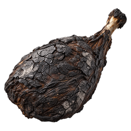Burnt GameTier 1 · foodBurnt GamefoodLeft on the range. Black through and nothing left worth eating.Value 1 · sells for 1</a>
<a class="corealm-item-tile" id="burnt-minnow" data-item-id="burnt_minnow" href="./burnt_minnow/" aria-label="Burnt Minnow" aria-describedby="item-tooltip-burnt_minnow">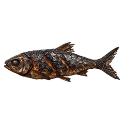Burnt MinnowTier 1 · foodBurnt MinnowfoodCharred through. Nothing left worth eating.Value 1 · sells for 1</a>
<a class="corealm-item-tile" id="roast-game" data-item-id="roast_game" href="./roast_game/" aria-label="Roast Game" aria-describedby="item-tooltip-roast_game">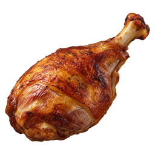Roast GameTier 1 · foodRoast GamefoodTurned over a range until the fat stops running. Frontier cooking, and it works.Heals 3 health.Value 24 · sells for 14</a>
<a class="corealm-item-tile" id="seared-minnow" data-item-id="seared_minnow" href="./seared_minnow/" aria-label="Seared Minnow" aria-describedby="item-tooltip-seared_minnow">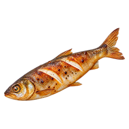Seared MinnowTier 1 · foodSeared MinnowfoodTwo minutes over a range and it stops being mostly bone.Heals 3 health.Value 22 · sells for 13</a>
<a class="corealm-item-tile" id="air-essence" data-item-id="air_essence" href="./air_essence/" aria-label="Air Essence" aria-describedby="item-tooltip-air_essence">Air EssenceTier 1 · resourceAir Essenceresource · stacksA stackable charge drawn from the distant Farmland cache.Value 9 · sells for 5</a>
<a class="corealm-item-tile" id="copper-ore" data-item-id="grithe_ore" href="./grithe_ore/" aria-label="Copper Ore" aria-describedby="item-tooltip-grithe_ore">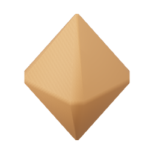Copper OreTier 1 · resourceCopper OreresourceGrey ore, streaked rust-red. Smelts easily, which is the only nice thing about it.Value 12 · sells for 7</a>
<a class="corealm-item-tile" id="limestone" data-item-id="march_stone" href="./march_stone/" aria-label="Limestone" aria-describedby="item-tooltip-march_stone">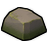LimestoneTier 1 · resourceLimestoneresourceCrumbly limestone from the Copper Pit. Every furnace on the frontier runs on it as flux.Value 5 · sells for 3</a>
<a class="corealm-item-tile" id="minnow" data-item-id="silt_minnow" href="./silt_minnow/" aria-label="Minnow" aria-describedby="item-tooltip-silt_minnow">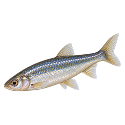MinnowTier 1 · resourceMinnowresourceA palm-sized fish out of the River shallows. Raw, it is mostly bone.Value 14 · sells for 8</a>
<a class="corealm-item-tile" id="pine-log" data-item-id="palewood_log" href="./palewood_log/" aria-label="Pine Log" aria-describedby="item-tooltip-palewood_log">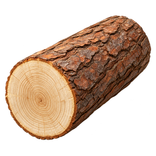Pine LogTier 1 · resourcePine LogresourcePale, straight-grained, and dries in a day. The march is short of everything except this.Value 10 · sells for 6</a>
<a class="corealm-item-tile" id="raw-game-meat" data-item-id="raw_game_meat" href="./raw_game_meat/" aria-label="Raw Game Meat" aria-describedby="item-tooltip-raw_game_meat">Raw Game MeatTier 1 · resourceRaw Game MeatresourceWhatever the Farmland was carrying. Fowl, goat or rabbit, jointed the same way.Value 12 · sells for 7</a>
<a class="corealm-item-tile" id="copper-hatchet" data-item-id="grithe_hatchet" href="./grithe_hatchet/" aria-label="Copper Hatchet" aria-describedby="item-tooltip-grithe_hatchet">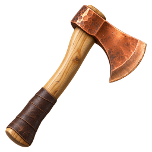Copper HatchetTier 1 · toolCopper HatchettoolLight, blunt-ish, and enough for pine. Two effective Woodcutting levels.Woodcutting tool, +2 effective levels.Value 55 · sells for 33</a>
<a class="corealm-item-tile" id="copper-pickaxe" data-item-id="grithe_pickaxe" href="./grithe_pickaxe/" aria-label="Copper Pickaxe" aria-describedby="item-tooltip-grithe_pickaxe">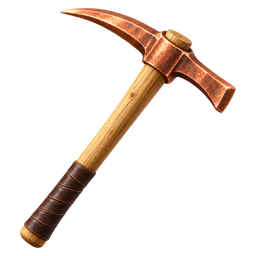Copper PickaxeTier 1 · toolCopper PickaxetoolA bar of Copper on an pine haft. Adds two effective Mining levels.Mining tool, +2 effective levels.Value 60 · sells for 36</a>
<a class="corealm-item-tile" id="pine-rod" data-item-id="palewood_rod" href="./palewood_rod/" aria-label="Pine Rod" aria-describedby="item-tooltip-palewood_rod">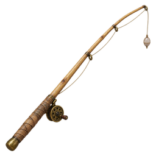Pine RodTier 1 · toolPine RodtoolA shaft, a hide line, and a bent pin. Two effective Fishing levels.Fishing tool, +2 effective levels.Value 45 · sells for 27</a>

## Tier 5

<a class="corealm-item-tile" id="iron-bar" data-item-id="corven_bar" href="./corven_bar/" aria-label="Iron Bar" aria-describedby="item-tooltip-corven_bar">Iron BarTier 5 · barIron BarbarDark and dense. Rings a full tone lower than Copper on the anvil.Value 110 · sells for 66</a>
<a class="corealm-item-tile" id="amber" data-item-id="vell_amber" href="./vell_amber/" aria-label="Amber" aria-describedby="item-tooltip-vell_amber">AmberTier 5 · componentAmbercomponent · stacksFossil resin from under the deepwood. Warm in the hand and nobody knows why.Value 70 · sells for 42</a>
<a class="corealm-item-tile" id="ash-handle" data-item-id="duskoak_handle" href="./duskoak_handle/" aria-label="Ash Handle" aria-describedby="item-tooltip-duskoak_handle">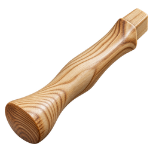Ash HandleTier 5 · componentAsh Handlecomponent · stacksOiled ash with enough weight to balance an Iron head.Value 23 · sells for 14</a>
<a class="corealm-item-tile" id="ash-shaft" data-item-id="duskoak_shaft" href="./duskoak_shaft/" aria-label="Ash Shaft" aria-describedby="item-tooltip-duskoak_shaft">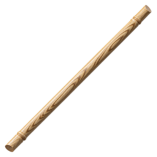Ash ShaftTier 5 · componentAsh Shaftcomponent · stacksAsh, turned down and oiled. Will not warp in Woodlands damp.Value 14 · sells for 8</a>
<a class="corealm-item-tile" id="badger-bristle" data-item-id="badger_bristle" href="./badger_bristle/" aria-label="Badger Bristle" aria-describedby="item-tooltip-badger_bristle">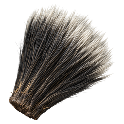Badger BristleTier 5 · componentBadger Bristlecomponent · stacksStiff black and silver bristles. Worked into leg linings, they save a sheet of hide.Value 8 · sells for 5</a>
<a class="corealm-item-tile" id="curved-tusk" data-item-id="curved_tusk" href="./curved_tusk/" aria-label="Curved Tusk" aria-describedby="item-tooltip-curved_tusk">Curved TuskTier 5 · componentCurved TuskcomponentIvory, yellowed, and ground to an edge by the animal's own jaw.Value 72 · sells for 43</a>
<a class="corealm-item-tile" id="earth-orb" data-item-id="earth_orb" href="./earth_orb/" aria-label="Earth Orb" aria-describedby="item-tooltip-earth_orb">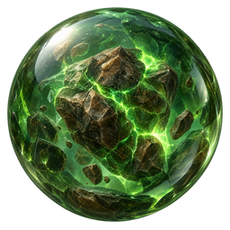Earth OrbTier 5 · componentEarth OrbcomponentA region-boss core used to craft a charged Earth wand or staff.Craft this into an Earth wand or staff. The finished weapon starts with 1,000 charges.Value 0 · sells for 0</a>
<a class="corealm-item-tile" id="heron-quill" data-item-id="heron_quill" href="./heron_quill/" aria-label="Heron Quill" aria-describedby="item-tooltip-heron_quill">Heron QuillTier 5 · componentHeron Quillcomponent · stacksA long hollow flight quill. Cut around an amber bead, it steadies a casting charm.Value 8 · sells for 5</a>
<a class="corealm-item-tile" id="horsehair" data-item-id="horse_tailhair" href="./horse_tailhair/" aria-label="Horsehair" aria-describedby="item-tooltip-horse_tailhair">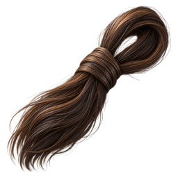HorsehairTier 5 · componentHorsehaircomponent · stacksLong strong strands. Braided into fishing line, they replace a rod's hide binding.Value 8 · sells for 5</a>
<a class="corealm-item-tile" id="lynx-sinew" data-item-id="lynx_sinew" href="./lynx_sinew/" aria-label="Lynx Sinew" aria-describedby="item-tooltip-lynx_sinew">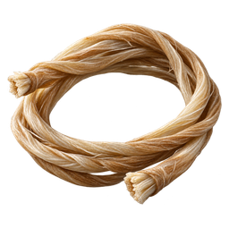Lynx SinewTier 5 · componentLynx Sinewcomponent · stacksSpringy tendon, cleaned and dried. A tight winding gives a hunter's ring its grip.Value 8 · sells for 5</a>
<a class="corealm-item-tile" id="snail-mucus" data-item-id="snail_mucus" href="./snail_mucus/" aria-label="Snail Mucus" aria-describedby="item-tooltip-snail_mucus">Snail MucusTier 5 · componentSnail Mucuscomponent · stacksA sealed dab of clear adhesive. It bonds a wooden shield's layers in place of a metal boss.Value 8 · sells for 5</a>
<a class="corealm-item-tile" id="spider-silk" data-item-id="spider_thread" href="./spider_thread/" aria-label="Spider Silk" aria-describedby="item-tooltip-spider_thread">Spider SilkTier 5 · componentSpider Silkcomponent · stacksA reel of strong dry silk. Close stitching makes a full robe from fewer hide panels.Value 8 · sells for 5</a>
<a class="corealm-item-tile" id="stag-antler" data-item-id="stag_antler" href="./stag_antler/" aria-label="Stag Antler" aria-describedby="item-tooltip-stag_antler">Stag AntlerTier 5 · componentStag AntlercomponentA six-point stag antler. Cut and polished, it makes a strong knife handle.Value 78 · sells for 47</a>
<a class="corealm-item-tile" id="tapir-leather" data-item-id="tapir_leather" href="./tapir_leather/" aria-label="Tapir Leather" aria-describedby="item-tooltip-tapir_leather">Tapir LeatherTier 5 · componentTapir Leathercomponent · stacksThick strips from a tapir's flank. Trim three strips into two standard hide sheets.Value 8 · sells for 5</a>
<a class="corealm-item-tile" id="thick-hide" data-item-id="bramble_hide" href="./bramble_hide/" aria-label="Thick Hide" aria-describedby="item-tooltip-bramble_hide">Thick HideTier 5 · componentThick HidecomponentDeepwood deer and hog, thorns still in the seam. Nothing in Woodlands tans clean.Value 55 · sells for 33</a>
<a class="corealm-item-tile" id="venom-gland" data-item-id="venom_gland" href="./venom_gland/" aria-label="Venom Gland" aria-describedby="item-tooltip-venom_gland">Venom GlandTier 5 · componentVenom Glandcomponent · stacksStill full. Handled with the same care you would give a lit lamp in a barn.Value 64 · sells for 38</a>
<a class="corealm-item-tile" id="wolf-fang" data-item-id="coyote_fang" href="./coyote_fang/" aria-label="Wolf Fang" aria-describedby="item-tooltip-coyote_fang">Wolf FangTier 5 · componentWolf Fangcomponent · stacksLong in the root, which is the part nobody expects until they pull one.Value 58 · sells for 35</a>
<a class="corealm-item-tile" id="ash-shield" data-item-id="duskoak_shield" href="./duskoak_shield/" aria-label="Ash Shield" aria-describedby="item-tooltip-duskoak_shield">Ash ShieldTier 5 · equipmentAsh ShieldequipmentLaminated ash over an Iron boss. Heavy enough to lean on.Accuracy+1Armour+8Magic armour+4Vitality+1Requires Melee 5Value 240 · sells for 144</a>
<a class="corealm-item-tile" id="ash-staff" data-item-id="duskoak_staff" href="./duskoak_staff/" aria-label="Ash Staff" aria-describedby="item-tooltip-duskoak_staff">Ash StaffTier 5 · equipmentAsh StaffequipmentDark ash banded in Iron around an empty, unlit crown.Power+2Magic accuracy+12Magic power+11Magic armour+2Cast cadence 3.0 sStaff: two-handed, slower casts, stronger hits.Requires Magic 5Value 500 · sells for 300</a>
<a class="corealm-item-tile" id="ash-wand" data-item-id="duskoak_wand" href="./duskoak_wand/" aria-label="Ash Wand" aria-describedby="item-tooltip-duskoak_wand">Ash WandTier 5 · equipmentAsh WandequipmentDark ash with an empty crown. Its polished wood remains unlit on its own.Magic accuracy+9Magic power+6Magic armour+1Cast cadence 2.2 sWand: one-handed, faster casts, weaker hits.Requires Magic 5Value 340 · sells for 204</a>
<a class="corealm-item-tile" id="earth-staff" data-item-id="earth_staff" href="./earth_staff/" aria-label="Earth Staff" aria-describedby="item-tooltip-earth_staff">Earth StaffTier 5 · equipmentEarth StaffequipmentAsh Staff fitted with a Earth Orb. Its charge pays for matching spells before carried Essence.Power+2Armour+1Magic accuracy+15Magic power+13Magic armour+5Vitality+1Cast cadence 3.0 sStaff: two-handed, slower casts, stronger hits.Earth weapon · 1,000 charge capacity.100 Earth Essence at an Essence Altar refills it.Requires Magic 5Value 500 · sells for 300</a>
<a class="corealm-item-tile" id="earth-wand" data-item-id="earth_wand" href="./earth_wand/" aria-label="Earth Wand" aria-describedby="item-tooltip-earth_wand">Earth WandTier 5 · equipmentEarth WandequipmentAsh Wand fitted with a Earth Orb. Its charge pays for matching spells before carried Essence.Armour+1Magic accuracy+12Magic power+8Magic armour+4Vitality+1Cast cadence 2.2 sWand: one-handed, faster casts, weaker hits.Earth weapon · 1,000 charge capacity.100 Earth Essence at an Essence Altar refills it.Requires Magic 5Value 340 · sells for 204</a>
<a class="corealm-item-tile" id="forest-ogre-staff" data-item-id="mossbound_staff" href="./mossbound_staff/" aria-label="Forest Ogre Staff" aria-describedby="item-tooltip-mossbound_staff">Forest Ogre StaffTier 5 · equipmentForest Ogre StaffequipmentAsh with a living green seam. Warm at the grip like a root in summer.Power+2Magic accuracy+14Magic power+13Magic armour+2Cast cadence 3.0 sStaff: two-handed, slower casts, stronger hits.Requires Magic 5Value 750 · sells for 450</a>
<a class="corealm-item-tile" id="forest-ogre-sword" data-item-id="mossbound_sword" href="./mossbound_sword/" aria-label="Forest Ogre Sword" aria-describedby="item-tooltip-mossbound_sword">Forest Ogre SwordTier 5 · equipmentForest Ogre SwordequipmentA Iron blade grown through with moss that will not die. It never rusts.Accuracy+16Power+16Attack speed 2.4 sRequires Melee 5Value 930 · sells for 558</a>
<a class="corealm-item-tile" id="heron-quill-charm" data-item-id="heron_quill_charm" href="./heron_quill_charm/" aria-label="Heron Quill Charm" aria-describedby="item-tooltip-heron_quill_charm">Heron Quill CharmTier 5 · equipmentHeron Quill CharmequipmentAn amber bead held inside a split quill. Sharpens spell aim; carries no warding.Magic accuracy+2Requires Magic 5Value 360 · sells for 216</a>
<a class="corealm-item-tile" id="iron-boots" data-item-id="corven_boots" href="./corven_boots/" aria-label="Iron Boots" aria-describedby="item-tooltip-corven_boots">Iron BootsTier 5 · equipmentIron BootsequipmentPlated over the toe, soft in the sole. Deepwood floor is not forgiving.Accuracy+1Armour+2Magic armour+1Vitality+2Requires Melee 5Value 260 · sells for 156</a>
<a class="corealm-item-tile" id="iron-dagger" data-item-id="corven_dagger" href="./corven_dagger/" aria-label="Iron Dagger" aria-describedby="item-tooltip-corven_dagger">Iron DaggerTier 5 · equipmentIron DaggerequipmentDeepwood steel, dark and slightly oily to the touch.Accuracy+12Power+11Attack speed 2.4 sRequires Melee 5Value 320 · sells for 192</a>
<a class="corealm-item-tile" id="iron-gauntlets" data-item-id="corven_gauntlets" href="./corven_gauntlets/" aria-label="Iron Gauntlets" aria-describedby="item-tooltip-corven_gauntlets">Iron GauntletsTier 5 · equipmentIron GauntletsequipmentFingered plate. You can hold a rod in these, badly.Accuracy+1Armour+1Magic armour+1Vitality+2Requires Melee 5Value 260 · sells for 156</a>
<a class="corealm-item-tile" id="iron-greaves" data-item-id="corven_greaves" href="./corven_greaves/" aria-label="Iron Greaves" aria-describedby="item-tooltip-corven_greaves">Iron GreavesTier 5 · equipmentIron GreavesequipmentPlated legs. Slower over a root field, worth it under a husk.Accuracy+1Armour+7Magic armour+2Vitality+3Requires Melee 5Value 700 · sells for 420</a>
<a class="corealm-item-tile" id="iron-helm" data-item-id="corven_helm" href="./corven_helm/" aria-label="Iron Helm" aria-describedby="item-tooltip-corven_helm">Iron HelmTier 5 · equipmentIron HelmequipmentA full helm with a narrow sight slit.Accuracy+1Armour+5Magic armour+1Vitality+2Requires Melee 5Value 380 · sells for 228</a>
<a class="corealm-item-tile" id="iron-pendant" data-item-id="corven_pendant" href="./corven_pendant/" aria-label="Iron Pendant" aria-describedby="item-tooltip-corven_pendant">Iron PendantTier 5 · equipmentIron PendantequipmentA slice of amber on an Iron chain. Warm, which nobody has explained.Accuracy+1Magic accuracy+1Magic armour+1Requires Melee 5Value 360 · sells for 216</a>
<a class="corealm-item-tile" id="iron-plate" data-item-id="corven_plate" href="./corven_plate/" aria-label="Iron Plate" aria-describedby="item-tooltip-corven_plate">Iron PlateTier 5 · equipmentIron PlateequipmentThree bars of Iron, articulated at the waist so you can still bend to pick things up.Accuracy+2Armour+10Magic armour+2Vitality+4Requires Melee 5Value 760 · sells for 456</a>
<a class="corealm-item-tile" id="iron-ring" data-item-id="corven_ring" href="./corven_ring/" aria-label="Iron Ring" aria-describedby="item-tooltip-corven_ring">Iron RingTier 5 · equipmentIron RingequipmentIron band, amber set flush so it does not catch.Accuracy+1Requires Melee 5Value 330 · sells for 198</a>
<a class="corealm-item-tile" id="iron-sword" data-item-id="corven_sword" href="./corven_sword/" aria-label="Iron Sword" aria-describedby="item-tooltip-corven_sword">Iron SwordTier 5 · equipmentIron SwordequipmentA long Iron blade. The standard by which a Woodlands hand is judged.Accuracy+14Power+14Attack speed 2.4 sRequires Melee 5Value 620 · sells for 372</a>
<a class="corealm-item-tile" id="lynx-sinew-ring" data-item-id="lynx_sinew_ring" href="./lynx_sinew_ring/" aria-label="Lynx Sinew Ring" aria-describedby="item-tooltip-lynx_sinew_ring">Lynx Sinew RingTier 5 · equipmentLynx Sinew RingequipmentIron wire wound with taut sinew. Adds force to a blow without helping it land.Power+1Requires Melee 5Value 330 · sells for 198</a>
<a class="corealm-item-tile" id="stone-charm" data-item-id="stone_charm" href="./stone_charm/" aria-label="Stone Charm" aria-describedby="item-tooltip-stone_charm">Stone CharmTier 5 · equipmentStone CharmequipmentA pierced river stone. Stonebrand was worked out by someone holding one of these.Magic armour+1Requires Magic 5Value 360 · sells for 216</a>
<a class="corealm-item-tile" id="stone-ring" data-item-id="stone_ring" href="./stone_ring/" aria-label="Stone Ring" aria-describedby="item-tooltip-stone_ring">Stone RingTier 5 · equipmentStone RingequipmentA grey band that pulls slightly toward the ground.Magic accuracy+1Magic armour+1Requires Magic 5Value 330 · sells for 198</a>
<a class="corealm-item-tile" id="thick-hide-boots" data-item-id="bramblehide_boots" href="./bramblehide_boots/" aria-label="Thick Hide Boots" aria-describedby="item-tooltip-bramblehide_boots">Thick Hide BootsTier 5 · equipmentThick Hide BootsequipmentLaced to the knee against the root field.Magic accuracy+1Magic armour+2Vitality+1Requires Magic 5Value 220 · sells for 132</a>
<a class="corealm-item-tile" id="thick-hide-hood" data-item-id="bramblehide_hood" href="./bramblehide_hood/" aria-label="Thick Hide Hood" aria-describedby="item-tooltip-bramblehide_hood">Thick Hide HoodTier 5 · equipmentThick Hide HoodequipmentDeepwood hide, still faintly thorned along the seam.Armour+1Magic accuracy+2Magic power+1Magic armour+4Vitality+2Requires Magic 5Value 300 · sells for 180</a>
<a class="corealm-item-tile" id="thick-hide-leggings" data-item-id="bramblehide_leggings" href="./bramblehide_leggings/" aria-label="Thick Hide Leggings" aria-describedby="item-tooltip-bramblehide_leggings">Thick Hide LeggingsTier 5 · equipmentThick Hide LeggingsequipmentLong hide leggings cut for a full stride.Armour+1Magic accuracy+2Magic power+1Magic armour+5Vitality+2Requires Magic 5Value 540 · sells for 324</a>
<a class="corealm-item-tile" id="thick-hide-robe" data-item-id="bramblehide_robe" href="./bramblehide_robe/" aria-label="Thick Hide Robe" aria-describedby="item-tooltip-bramblehide_robe">Thick Hide RobeTier 5 · equipmentThick Hide RobeequipmentHeavy hide, waxed. Sheds a Thornbound's spores and most of the rain.Armour+1Magic accuracy+3Magic power+1Magic armour+8Vitality+3Requires Magic 5Value 600 · sells for 360</a>
<a class="corealm-item-tile" id="thick-hide-wraps" data-item-id="bramblehide_wraps" href="./bramblehide_wraps/" aria-label="Thick Hide Wraps" aria-describedby="item-tooltip-bramblehide_wraps">Thick Hide WrapsTier 5 · equipmentThick Hide WrapsequipmentWrapped to the second knuckle. Casting hand stays free.Magic armour+2Vitality+1Requires Magic 5Value 220 · sells for 132</a>
<a class="corealm-item-tile" id="burnt-trout" data-item-id="burnt_trout" href="./burnt_trout/" aria-label="Burnt Trout" aria-describedby="item-tooltip-burnt_trout">Burnt TroutTier 5 · foodBurnt TroutfoodYou left it on. It happens until Cooking 20.Value 1 · sells for 1</a>
<a class="corealm-item-tile" id="burnt-venison" data-item-id="burnt_venison" href="./burnt_venison/" aria-label="Burnt Venison" aria-describedby="item-tooltip-burnt_venison">Burnt VenisonTier 5 · foodBurnt VenisonfoodA stag walked all summer for this and you left it on the coals.Value 1 · sells for 1</a>
<a class="corealm-item-tile" id="roast-venison" data-item-id="roast_venison" href="./roast_venison/" aria-label="Roast Venison" aria-describedby="item-tooltip-roast_venison">Roast VenisonTier 5 · foodRoast VenisonfoodSeared hard and rested. The one meal in Oakwood nobody complains about.Heals 7 health.Value 66 · sells for 40</a>
<a class="corealm-item-tile" id="seared-trout" data-item-id="seared_trout" href="./seared_trout/" aria-label="Seared Trout" aria-describedby="item-tooltip-seared_trout">Seared TroutTier 5 · foodSeared TroutfoodSplit, salted, and laid on the stone. Oakwood's entire cuisine.Heals 7 health.Value 62 · sells for 37</a>
<a class="corealm-item-tile" id="ash-log" data-item-id="duskoak_log" href="./duskoak_log/" aria-label="Ash Log" aria-describedby="item-tooltip-duskoak_log">Ash LogTier 5 · resourceAsh LogresourceClose-grained ash from the Woodlands canopy. Seasoned for strong handles and shields.Value 38 · sells for 23</a>
<a class="corealm-item-tile" id="earth-essence" data-item-id="earth_essence" href="./earth_essence/" aria-label="Earth Essence" aria-describedby="item-tooltip-earth_essence">Earth EssenceTier 5 · resourceEarth Essenceresource · stacksDense green-brown essence mined beneath the Woodlands roots.Value 24 · sells for 14</a>
<a class="corealm-item-tile" id="iron-ore" data-item-id="corven_ore" href="./corven_ore/" aria-label="Iron Ore" aria-describedby="item-tooltip-corven_ore">Iron OreTier 5 · resourceIron OreresourceDark deepwood ore. Heavier than it looks and slightly oily on the break.Value 42 · sells for 25</a>
<a class="corealm-item-tile" id="raw-venison" data-item-id="raw_venison" href="./raw_venison/" aria-label="Raw Venison" aria-describedby="item-tooltip-raw_venison">Raw VenisonTier 5 · resourceRaw VenisonresourceDark, close-grained deepwood meat. Hangs two days before it is worth cooking.Value 46 · sells for 28</a>
<a class="corealm-item-tile" id="trout" data-item-id="bramble_trout" href="./bramble_trout/" aria-label="Trout" aria-describedby="item-tooltip-bramble_trout">TroutTier 5 · resourceTroutresourceBlack-backed trout from the Blackwater pools. Fights the line the whole way in.Value 44 · sells for 26</a>
<a class="corealm-item-tile" id="ash-rod" data-item-id="duskoak_rod" href="./duskoak_rod/" aria-label="Ash Rod" aria-describedby="item-tooltip-duskoak_rod">Ash RodTier 5 · toolAsh RodtoolSpringy enough for a trout. Five effective Fishing levels.Fishing tool, +5 effective levels.Value 190 · sells for 114</a>
<a class="corealm-item-tile" id="iron-hatchet" data-item-id="corven_hatchet" href="./corven_hatchet/" aria-label="Iron Hatchet" aria-describedby="item-tooltip-corven_hatchet">Iron HatchetTier 5 · toolIron HatchettoolIron bit, deep bevel. Five effective Woodcutting levels.Woodcutting tool, +5 effective levels.Value 225 · sells for 135</a>
<a class="corealm-item-tile" id="iron-pickaxe" data-item-id="corven_pickaxe" href="./corven_pickaxe/" aria-label="Iron Pickaxe" aria-describedby="item-tooltip-corven_pickaxe">Iron PickaxeTier 5 · toolIron PickaxetoolIron head, ash haft. Five effective Mining levels.Mining tool, +5 effective levels.Value 240 · sells for 144</a>

## Tier 10

<a class="corealm-item-tile" id="cobalt-bar" data-item-id="kaldite_bar" href="./kaldite_bar/" aria-label="Cobalt Bar" aria-describedby="item-tooltip-kaldite_bar">Cobalt BarTier 10 · barCobalt BarbarBlack with a blue sheen. Holds an edge through cairn stone, which is why Hillcrest exists.Value 250 · sells for 150</a>
<a class="corealm-item-tile" id="aurochs-horn" data-item-id="aurochs_horn" href="./aurochs_horn/" aria-label="Aurochs Horn" aria-describedby="item-tooltip-aurochs_horn">Aurochs HornTier 10 · componentAurochs HorncomponentAs long as your arm and heavier. The terrace herds are the last ones anywhere.Value 178 · sells for 107</a>
<a class="corealm-item-tile" id="bear-claw" data-item-id="bear_claw" href="./bear_claw/" aria-label="Bear Claw" aria-describedby="item-tooltip-bear_claw">Bear ClawTier 10 · componentBear Clawcomponent · stacksLonger than a finger and blunt from stone. Hillcrest hangs them over doorways.Value 150 · sells for 90</a>
<a class="corealm-item-tile" id="beetle-jaw" data-item-id="beetle_mandible" href="./beetle_mandible/" aria-label="Beetle Jaw" aria-describedby="item-tooltip-beetle_mandible">Beetle JawTier 10 · componentBeetle Jawcomponent · stacksA hooked jaw hard enough to score stone. Several brace a pick head with less metal.Value 17 · sells for 10</a>
<a class="corealm-item-tile" id="bighorn-wool" data-item-id="bighorn_fleece" href="./bighorn_fleece/" aria-label="Bighorn Wool" aria-describedby="item-tooltip-bighorn_fleece">Bighorn WoolTier 10 · componentBighorn Woolcomponent · stacksDense wool from a ridge ram. A felted lining stretches a pelt into a pair of leggings.Value 17 · sells for 10</a>
<a class="corealm-item-tile" id="boar-bristle" data-item-id="boar_bristle" href="./boar_bristle/" aria-label="Boar Bristle" aria-describedby="item-tooltip-boar_bristle">Boar BristleTier 10 · componentBoar Bristlecomponent · stacksA fistful of black wire off a wild boar's shoulder. It will not lie flat.Value 96 · sells for 58</a>
<a class="corealm-item-tile" id="bustard-plume" data-item-id="bustard_plume" href="./bustard_plume/" aria-label="Bustard Plume" aria-describedby="item-tooltip-bustard_plume">Bustard PlumeTier 10 · componentBustard Plumecomponent · stacksA broad feather from a heavy moorland bird. Layered plumes replace a robe's inner pelt.Value 17 · sells for 10</a>
<a class="corealm-item-tile" id="crab-claw" data-item-id="crab_claw" href="./crab_claw/" aria-label="Crab Claw" aria-describedby="item-tooltip-crab_claw">Crab ClawTier 10 · componentCrab ClawcomponentOff a giant crab, and big enough to have taken a pick handle in half.Value 158 · sells for 95</a>
<a class="corealm-item-tile" id="crocodile-armor-plate" data-item-id="crocodile_scute" href="./crocodile_scute/" aria-label="Crocodile Armor Plate" aria-describedby="item-tooltip-crocodile_scute">Crocodile Armor PlateTier 10 · componentCrocodile Armor Platecomponent · stacksA hard plate from a crocodile's back. Scute soles let one pelt cover two pairs of boots.Value 17 · sells for 10</a>
<a class="corealm-item-tile" id="fur-pelt" data-item-id="cairn_pelt" href="./cairn_pelt/" aria-label="Fur Pelt" aria-describedby="item-tooltip-cairn_pelt">Fur PeltTier 10 · componentFur PeltcomponentWinter coat off something that lived above the treeline. Takes no dye and does not tear.Value 130 · sells for 78</a>
<a class="corealm-item-tile" id="garnet" data-item-id="cairn_garnet" href="./cairn_garnet/" aria-label="Garnet" aria-describedby="item-tooltip-cairn_garnet">GarnetTier 10 · componentGarnetcomponent · stacksDeep red, cut square by the rock itself. Hillcrest jewellers cage it in Cobalt.Value 160 · sells for 96</a>
<a class="corealm-item-tile" id="ibex-horn" data-item-id="ibex_horn" href="./ibex_horn/" aria-label="Ibex Horn" aria-describedby="item-tooltip-ibex_horn">Ibex HornTier 10 · componentIbex HorncomponentRidged the whole length, one ring a winter. This one counted eleven.Value 165 · sells for 99</a>
<a class="corealm-item-tile" id="moose-antler" data-item-id="moose_antler_palm" href="./moose_antler_palm/" aria-label="Moose Antler" aria-describedby="item-tooltip-moose_antler_palm">Moose AntlerTier 10 · componentMoose Antlercomponent · stacksA flat antler section. Cut and polished, it makes a broad protective charm.Value 17 · sells for 10</a>
<a class="corealm-item-tile" id="oak-handle" data-item-id="cairnpine_handle" href="./cairnpine_handle/" aria-label="Oak Handle" aria-describedby="item-tooltip-cairnpine_handle">Oak HandleTier 10 · componentOak Handlecomponent · stacksOak shaped around the grain so a Cobalt tang will not split it.Value 53 · sells for 32</a>
<a class="corealm-item-tile" id="oak-shaft" data-item-id="cairnpine_shaft" href="./cairnpine_shaft/" aria-label="Oak Shaft" aria-describedby="item-tooltip-cairnpine_shaft">Oak ShaftTier 10 · componentOak Shaftcomponent · stacksResinous, springy, and heavy. Takes a Cobalt ferrule without splitting.Value 32 · sells for 19</a>
<a class="corealm-item-tile" id="pale-dragon-plate" data-item-id="nightmare_plate" href="./nightmare_plate/" aria-label="Pale Dragon Plate" aria-describedby="item-tooltip-nightmare_plate">Pale Dragon PlateTier 10 · componentPale Dragon Platecomponent · stacksA ridged shoulder plate. Riveted over a helm, it replaces part of the Cobalt shell.Value 17 · sells for 10</a>
<a class="corealm-item-tile" id="porcupine-quill" data-item-id="porcupine_quill" href="./porcupine_quill/" aria-label="Porcupine Quill" aria-describedby="item-tooltip-porcupine_quill">Porcupine QuillTier 10 · componentPorcupine Quillcomponent · stacksA thick hollow quill with a hard point. Short sections can be set around a guard ring.Value 17 · sells for 10</a>
<a class="corealm-item-tile" id="rat-tail" data-item-id="rat_tail" href="./rat_tail/" aria-label="Rat Tail" aria-describedby="item-tooltip-rat_tail">Rat TailTier 10 · componentRat Tailcomponent · stacksStone Cavern pays a bounty per tail. Nobody in Hillcrest asks what the count is for.Value 84 · sells for 50</a>
<a class="corealm-item-tile" id="scorpion-stinger" data-item-id="scorpion_stinger" href="./scorpion_stinger/" aria-label="Scorpion Stinger" aria-describedby="item-tooltip-scorpion_stinger">Scorpion StingerTier 10 · componentScorpion Stingercomponent · stacksBarb and bulb both intact. Dry, it is a needle; wet, it is still a problem.Value 140 · sells for 84</a>
<a class="corealm-item-tile" id="tortoise-shell-plate" data-item-id="tortoise_shell_plate" href="./tortoise_shell_plate/" aria-label="Tortoise Shell Plate" aria-describedby="item-tooltip-tortoise_shell_plate">Tortoise Shell PlateTier 10 · componentTortoise Shell Platecomponent · stacksA curved shell section. Lash several across a wooden shield in place of its metal boss.Value 17 · sells for 10</a>
<a class="corealm-item-tile" id="water-orb" data-item-id="water_orb" href="./water_orb/" aria-label="Water Orb" aria-describedby="item-tooltip-water_orb">Water OrbTier 10 · componentWater OrbcomponentA region-boss core used to craft a charged Water wand or staff.Craft this into a Water wand or staff. The finished weapon starts with 1,000 charges.Value 0 · sells for 0</a>
<a class="corealm-item-tile" id="antler-charm" data-item-id="antler_palm_charm" href="./antler_palm_charm/" aria-label="Antler Charm" aria-describedby="item-tooltip-antler_palm_charm">Antler CharmTier 10 · equipmentAntler CharmequipmentA broad antler disc on a Cobalt chain. Helps absorb punishment, with no aiming bonus.Armour+1Vitality+2Requires Melee 10Value 840 · sells for 504</a>
<a class="corealm-item-tile" id="cave-ogre-staff" data-item-id="tideworn_staff" href="./tideworn_staff/" aria-label="Cave Ogre Staff" aria-describedby="item-tooltip-tideworn_staff">Cave Ogre StaffTier 10 · equipmentCave Ogre StaffequipmentOak bleached and salt-cured. The cage weeps a little in the cold.Power+4Magic accuracy+27Magic power+22Magic armour+4Cast cadence 3.0 sStaff: two-handed, slower casts, stronger hits.Requires Magic 10Value 1,770 · sells for 1,062</a>
<a class="corealm-item-tile" id="cave-ogre-sword" data-item-id="tideworn_sword" href="./tideworn_sword/" aria-label="Cave Ogre Sword" aria-describedby="item-tooltip-tideworn_sword">Cave Ogre SwordTier 10 · equipmentCave Ogre SwordequipmentCobalt worked smooth as sea glass. It swings like it remembers the water.Accuracy+31Power+29Attack speed 2.4 sRequires Melee 10Value 2,175 · sells for 1,305</a>
<a class="corealm-item-tile" id="cobalt-boots" data-item-id="kaldite_boots" href="./kaldite_boots/" aria-label="Cobalt Boots" aria-describedby="item-tooltip-kaldite_boots">Cobalt BootsTier 10 · equipmentCobalt BootsequipmentCleated for wet cairn stone.Accuracy+1Armour+3Magic armour+1Vitality+2Requires Melee 10Value 600 · sells for 360</a>
<a class="corealm-item-tile" id="cobalt-dagger" data-item-id="kaldite_dagger" href="./kaldite_dagger/" aria-label="Cobalt Dagger" aria-describedby="item-tooltip-kaldite_dagger">Cobalt DaggerTier 10 · equipmentCobalt DaggerequipmentA punch of black Cobalt with a needle point. It goes through moor-rot like paper.Accuracy+24Power+22Attack speed 2.4 sRequires Melee 9Value 760 · sells for 456</a>
<a class="corealm-item-tile" id="cobalt-gauntlets" data-item-id="kaldite_gauntlets" href="./kaldite_gauntlets/" aria-label="Cobalt Gauntlets" aria-describedby="item-tooltip-kaldite_gauntlets">Cobalt GauntletsTier 10 · equipmentCobalt GauntletsequipmentCobalt over the knuckle, garnet rivets. Loud.Accuracy+2Armour+2Magic armour+1Vitality+2Requires Melee 10Value 600 · sells for 360</a>
<a class="corealm-item-tile" id="cobalt-greaves" data-item-id="kaldite_greaves" href="./kaldite_greaves/" aria-label="Cobalt Greaves" aria-describedby="item-tooltip-kaldite_greaves">Cobalt GreavesTier 10 · equipmentCobalt GreavesequipmentFull leg plate, hinged at the knee.Accuracy+2Armour+12Magic armour+3Vitality+4Requires Melee 10Value 1,620 · sells for 972</a>
<a class="corealm-item-tile" id="cobalt-helm" data-item-id="kaldite_helm" href="./kaldite_helm/" aria-label="Cobalt Helm" aria-describedby="item-tooltip-kaldite_helm">Cobalt HelmTier 10 · equipmentCobalt HelmequipmentA closed helm with a stone-cutter's brow ridge.Accuracy+2Armour+9Magic armour+2Vitality+2Requires Melee 10Value 880 · sells for 528</a>
<a class="corealm-item-tile" id="cobalt-pendant" data-item-id="kaldite_pendant" href="./kaldite_pendant/" aria-label="Cobalt Pendant" aria-describedby="item-tooltip-kaldite_pendant">Cobalt PendantTier 10 · equipmentCobalt PendantequipmentGarnet in a Cobalt claw. Cold no matter how long you wear it.Accuracy+1Magic accuracy+2Magic armour+2Requires Melee 10Value 840 · sells for 504</a>
<a class="corealm-item-tile" id="cobalt-plate" data-item-id="kaldite_plate" href="./kaldite_plate/" aria-label="Cobalt Plate" aria-describedby="item-tooltip-kaldite_plate">Cobalt PlateTier 10 · equipmentCobalt PlateequipmentThree bars of Cobalt. Quarry crews were buried in these, which is not a selling point.Accuracy+3Armour+18Magic armour+4Vitality+5Requires Melee 10Value 1,760 · sells for 1,056</a>
<a class="corealm-item-tile" id="cobalt-ring" data-item-id="kaldite_ring" href="./kaldite_ring/" aria-label="Cobalt Ring" aria-describedby="item-tooltip-kaldite_ring">Cobalt RingTier 10 · equipmentCobalt RingequipmentA heavy band, garnet-set. It has a quarry number filed into the inside.Accuracy+1Requires Melee 10Value 780 · sells for 468</a>
<a class="corealm-item-tile" id="cobalt-sword" data-item-id="kaldite_sword" href="./kaldite_sword/" aria-label="Cobalt Sword" aria-describedby="item-tooltip-kaldite_sword">Cobalt SwordTier 10 · equipmentCobalt SwordequipmentHillcrest's best. Cobalt holds an edge through stone, which is the whole point up here.Accuracy+28Power+26Attack speed 2.4 sRequires Melee 10Value 1,450 · sells for 870</a>
<a class="corealm-item-tile" id="fur-boots" data-item-id="cairnpelt_boots" href="./cairnpelt_boots/" aria-label="Fur Boots" aria-describedby="item-tooltip-cairnpelt_boots">Fur BootsTier 10 · equipmentFur BootsequipmentSilent on stone. The quarry crews would have hated them.Armour+1Magic accuracy+1Magic armour+3Vitality+1Requires Magic 10Value 500 · sells for 300</a>
<a class="corealm-item-tile" id="fur-hood" data-item-id="cairnpelt_hood" href="./cairnpelt_hood/" aria-label="Fur Hood" aria-describedby="item-tooltip-cairnpelt_hood">Fur HoodTier 10 · equipmentFur HoodequipmentCut from a bear's winter coat. It does not take dye and it does not tear.Armour+1Magic accuracy+4Magic power+2Magic armour+8Vitality+2Requires Magic 10Value 700 · sells for 420</a>
<a class="corealm-item-tile" id="fur-leggings" data-item-id="cairnpelt_leggings" href="./cairnpelt_leggings/" aria-label="Fur Leggings" aria-describedby="item-tooltip-cairnpelt_leggings">Fur LeggingsTier 10 · equipmentFur LeggingsequipmentPelt to the ankle, weighted at the hem so it does not lift on the moor.Armour+1Magic accuracy+3Magic power+2Magic armour+9Vitality+3Requires Magic 10Value 1,260 · sells for 756</a>
<a class="corealm-item-tile" id="fur-robe" data-item-id="cairnpelt_robe" href="./cairnpelt_robe/" aria-label="Fur Robe" aria-describedby="item-tooltip-cairnpelt_robe">Fur RobeTier 10 · equipmentFur RobeequipmentThree pelts, stitched with Cobalt wire. Quarry Warden's floor is survivable in this.Armour+2Magic accuracy+6Magic power+3Magic armour+14Vitality+4Requires Magic 10Value 1,400 · sells for 840</a>
<a class="corealm-item-tile" id="fur-wraps" data-item-id="cairnpelt_wraps" href="./cairnpelt_wraps/" aria-label="Fur Wraps" aria-describedby="item-tooltip-cairnpelt_wraps">Fur WrapsTier 10 · equipmentFur WrapsequipmentPelt strips to the wrist. Garnet dust worked into the weave.Armour+1Magic accuracy+1Magic armour+3Vitality+1Requires Magic 10Value 500 · sells for 300</a>
<a class="corealm-item-tile" id="oak-shield" data-item-id="cairnpine_shield" href="./cairnpine_shield/" aria-label="Oak Shield" aria-describedby="item-tooltip-cairnpine_shield">Oak ShieldTier 10 · equipmentOak ShieldequipmentOak faced in Cobalt. It rings when a bear hits it, and the bear stops.Accuracy+2Armour+14Magic armour+6Vitality+1Requires Melee 10Value 560 · sells for 336</a>
<a class="corealm-item-tile" id="oak-staff" data-item-id="cairnpine_staff" href="./cairnpine_staff/" aria-label="Oak Staff" aria-describedby="item-tooltip-cairnpine_staff">Oak StaffTier 10 · equipmentOak StaffequipmentA two-handed oak shaft with an empty Cobalt cage. It stays dark until upgraded.Power+4Magic accuracy+24Magic power+20Magic armour+4Cast cadence 3.0 sStaff: two-handed, slower casts, stronger hits.Requires Magic 10Value 1,180 · sells for 708</a>
<a class="corealm-item-tile" id="oak-wand" data-item-id="cairnpine_wand" href="./cairnpine_wand/" aria-label="Oak Wand" aria-describedby="item-tooltip-cairnpine_wand">Oak WandTier 10 · equipmentOak WandequipmentResin-dark oak with an empty Cobalt socket and no light of its own.Magic accuracy+18Magic power+14Magic armour+3Cast cadence 2.2 sWand: one-handed, faster casts, weaker hits.Requires Magic 10Value 820 · sells for 492</a>
<a class="corealm-item-tile" id="porcupine-quill-ring" data-item-id="quillguard_ring" href="./quillguard_ring/" aria-label="Porcupine Quill Ring" aria-describedby="item-tooltip-quillguard_ring">Porcupine Quill RingTier 10 · equipmentPorcupine Quill RingequipmentBlunt quill sections set around Cobalt. A small guard for the weapon hand.Armour+2Requires Melee 10Value 780 · sells for 468</a>
<a class="corealm-item-tile" id="storm-charm" data-item-id="storm_charm" href="./storm_charm/" aria-label="Storm Charm" aria-describedby="item-tooltip-storm_charm">Storm CharmTier 10 · equipmentStorm CharmequipmentA garnet split by lightning and re-caged. Voltrend's namesake.Magic accuracy+1Magic armour+2Requires Magic 10Value 840 · sells for 504</a>
<a class="corealm-item-tile" id="storm-ring" data-item-id="storm_ring" href="./storm_ring/" aria-label="Storm Ring" aria-describedby="item-tooltip-storm_ring">Storm RingTier 10 · equipmentStorm RingequipmentIt ticks against other metal. Nobody in Hillcrest will keep one in a drawer.Magic accuracy+1Magic power+1Magic armour+1Requires Magic 10Value 780 · sells for 468</a>
<a class="corealm-item-tile" id="water-staff" data-item-id="water_staff" href="./water_staff/" aria-label="Water Staff" aria-describedby="item-tooltip-water_staff">Water StaffTier 10 · equipmentWater StaffequipmentOak Staff fitted with a Water Orb. Its charge pays for matching spells before carried Essence.Power+4Armour+2Magic accuracy+30Magic power+24Magic armour+10Vitality+1Cast cadence 3.0 sStaff: two-handed, slower casts, stronger hits.Water weapon · 1,000 charge capacity.100 Water Essence at an Essence Altar refills it.Requires Magic 10Value 1,180 · sells for 708</a>
<a class="corealm-item-tile" id="water-wand" data-item-id="water_wand" href="./water_wand/" aria-label="Water Wand" aria-describedby="item-tooltip-water_wand">Water WandTier 10 · equipmentWater WandequipmentOak Wand fitted with a Water Orb. Its charge pays for matching spells before carried Essence.Armour+2Magic accuracy+24Magic power+18Magic armour+9Vitality+1Cast cadence 2.2 sWand: one-handed, faster casts, weaker hits.Water weapon · 1,000 charge capacity.100 Water Essence at an Essence Altar refills it.Requires Magic 10Value 820 · sells for 492</a>
<a class="corealm-item-tile" id="burnt-haunch" data-item-id="burnt_haunch" href="./burnt_haunch/" aria-label="Burnt Haunch" aria-describedby="item-tooltip-burnt_haunch">Burnt HaunchTier 10 · foodBurnt HaunchfoodRuined, and it was the biggest thing you killed all week.Value 1 · sells for 1</a>
<a class="corealm-item-tile" id="burnt-perch" data-item-id="burnt_cragfin" href="./burnt_cragfin/" aria-label="Burnt Perch" aria-describedby="item-tooltip-burnt_cragfin">Burnt PerchTier 10 · foodBurnt PerchfoodNinety-six marks of fish, ruined. Hillcrest has opinions about this.Value 1 · sells for 1</a>
<a class="corealm-item-tile" id="roast-haunch" data-item-id="roast_haunch" href="./roast_haunch/" aria-label="Roast Haunch" aria-describedby="item-tooltip-roast_haunch">Roast HaunchTier 10 · foodRoast HaunchfoodFour hours over Hillcrest coals. It is a meal and most of a day's carrying.Heals 12 health.Value 118 · sells for 71</a>
<a class="corealm-item-tile" id="seared-perch" data-item-id="seared_cragfin" href="./seared_cragfin/" aria-label="Seared Perch" aria-describedby="item-tooltip-seared_cragfin">Seared PerchTier 10 · foodSeared PerchfoodThe reason anyone survives Quarry Warden's floor. Hillcrest will not sell you fewer than five.Heals 12 health.Value 70 · sells for 42</a>
<a class="corealm-item-tile" id="cobalt-ore" data-item-id="kaldite_ore" href="./kaldite_ore/" aria-label="Cobalt Ore" aria-describedby="item-tooltip-kaldite_ore">Cobalt OreTier 10 · resourceCobalt OreresourceBlack Highlands ore with a blue fracture. It takes a furnace twice to give anything up.Value 95 · sells for 57</a>
<a class="corealm-item-tile" id="oak-log" data-item-id="cairnpine_log" href="./cairnpine_log/" aria-label="Oak Log" aria-describedby="item-tooltip-cairnpine_log">Oak LogTier 10 · resourceOak LogresourceDense oak with a coarse, durable grain. It holds a Cobalt ferrule without splitting.Value 88 · sells for 53</a>
<a class="corealm-item-tile" id="perch" data-item-id="cragfin" href="./cragfin/" aria-label="Perch" aria-describedby="item-tooltip-cragfin">PerchTier 10 · resourcePerchresourceA slab-sided tarn fish with a spined dorsal. Hillcrest eats little else.Value 96 · sells for 58</a>
<a class="corealm-item-tile" id="raw-haunch" data-item-id="raw_haunch" href="./raw_haunch/" aria-label="Raw Haunch" aria-describedby="item-tooltip-raw_haunch">Raw HaunchTier 10 · resourceRaw HaunchresourceA whole hind quarter off something that lived above the treeline. Heavy.Value 88 · sells for 53</a>
<a class="corealm-item-tile" id="water-essence" data-item-id="water_essence" href="./water_essence/" aria-label="Water Essence" aria-describedby="item-tooltip-water_essence">Water EssenceTier 10 · resourceWater Essenceresource · stacksCold blue essence gathered from the far Highlands cache.Value 55 · sells for 33</a>
<a class="corealm-item-tile" id="cobalt-hatchet" data-item-id="kaldite_hatchet" href="./kaldite_hatchet/" aria-label="Cobalt Hatchet" aria-describedby="item-tooltip-kaldite_hatchet">Cobalt HatchetTier 10 · toolCobalt HatchettoolGoes through oak resin without gumming. Nine effective Woodcutting levels.Woodcutting tool, +9 effective levels.Value 600 · sells for 360</a>
<a class="corealm-item-tile" id="cobalt-pickaxe" data-item-id="kaldite_pickaxe" href="./kaldite_pickaxe/" aria-label="Cobalt Pickaxe" aria-describedby="item-tooltip-kaldite_pickaxe">Cobalt PickaxeTier 10 · toolCobalt PickaxetoolCobalt on oak. Nine effective Mining levels, and it will outlive you.Mining tool, +9 effective levels.Value 620 · sells for 372</a>
<a class="corealm-item-tile" id="oak-rod" data-item-id="cairnpine_rod" href="./cairnpine_rod/" aria-label="Oak Rod" aria-describedby="item-tooltip-cairnpine_rod">Oak RodTier 10 · toolOak RodtoolBuilt for perch, which fight like something with a grudge. Nine effective Fishing levels.Fishing tool, +9 effective levels.Value 480 · sells for 288</a>

## Tier 20

<a class="corealm-item-tile" id="titanium-bar" data-item-id="emberite_bar" href="./emberite_bar/" aria-label="Titanium Bar" aria-describedby="item-tooltip-emberite_bar">Titanium BarTier 20 · barTitanium BarbarThree ores and two flux stones a bar, and it comes off the furnace still glowing at the core.Value 760 · sells for 456</a>
<a class="corealm-item-tile" id="armored-dragon-scale" data-item-id="drake_scale" href="./drake_scale/" aria-label="Armored Dragon Scale" aria-describedby="item-tooltip-drake_scale">Armored Dragon ScaleTier 20 · componentArmored Dragon Scalecomponent · stacksA broad scale with a tough leather backing. Trim several into standard heavy hide sheets.Value 35 · sells for 21</a>
<a class="corealm-item-tile" id="centipede-chitin" data-item-id="centipede_chitin" href="./centipede_chitin/" aria-label="Centipede Chitin" aria-describedby="item-tooltip-centipede_chitin">Centipede ChitinTier 20 · componentCentipede Chitincomponent · stacksDark overlapping plates. Small segments fit an armored ring without spoiling its grip.Value 35 · sells for 21</a>
<a class="corealm-item-tile" id="demon-claw" data-item-id="ravager_talon" href="./ravager_talon/" aria-label="Demon Claw" aria-describedby="item-tooltip-ravager_talon">Demon ClawTier 20 · componentDemon Clawcomponent · stacksA hooked black claw. Cut down, it replaces the wooden grip beneath a Titanium blade.Value 35 · sells for 21</a>
<a class="corealm-item-tile" id="dire-bear-claw" data-item-id="ashback_claw" href="./ashback_claw/" aria-label="Dire Bear Claw" aria-describedby="item-tooltip-ashback_claw">Dire Bear ClawTier 20 · componentDire Bear Clawcomponent · stacksGrey to the root, like the bear it came off. Ashford doors hang two, crossed.Value 320 · sells for 192</a>
<a class="corealm-item-tile" id="dire-boar-tusk" data-item-id="cinder_tusk" href="./cinder_tusk/" aria-label="Dire Boar Tusk" aria-describedby="item-tooltip-cinder_tusk">Dire Boar TuskTier 20 · componentDire Boar TuskcomponentA boar tusk stained kiln-black. The point still goes through boot leather.Value 300 · sells for 180</a>
<a class="corealm-item-tile" id="fire-opal" data-item-id="fire_opal" href="./fire_opal/" aria-label="Fire Opal" aria-describedby="item-tooltip-fire_opal">Fire OpalTier 20 · componentFire Opalcomponent · stacksAn orange stone with a live spark in it. Ashford cages them in Titanium claws.Value 350 · sells for 210</a>
<a class="corealm-item-tile" id="fire-orb" data-item-id="fire_orb" href="./fire_orb/" aria-label="Fire Orb" aria-describedby="item-tooltip-fire_orb">Fire OrbTier 20 · componentFire OrbcomponentA region-boss core used to craft a charged Fire wand or staff.Craft this into a Fire wand or staff. The finished weapon starts with 1,000 charges.Value 0 · sells for 0</a>
<a class="corealm-item-tile" id="giant-viper-fang" data-item-id="kiln_fang" href="./kiln_fang/" aria-label="Giant Viper Fang" aria-describedby="item-tooltip-kiln_fang">Giant Viper FangTier 20 · componentGiant Viper Fangcomponent · stacksAn viper fang the colour of cooling slag. Hot to the touch for a day after the kill.Value 310 · sells for 186</a>
<a class="corealm-item-tile" id="heavy-hide" data-item-id="charhide" href="./charhide/" aria-label="Heavy Hide" aria-describedby="item-tooltip-charhide">Heavy HideTier 20 · componentHeavy HidecomponentFoothill hide seared grey at the edges. Sheds heat the way fur pelt sheds cold.Value 290 · sells for 174</a>
<a class="corealm-item-tile" id="large-ibex-horn" data-item-id="emberhorn" href="./emberhorn/" aria-label="Large Ibex Horn" aria-describedby="item-tooltip-emberhorn">Large Ibex HornTier 20 · componentLarge Ibex HorncomponentRidged ibex horn with a red cast the foothill dust never washes out of.Value 360 · sells for 216</a>
<a class="corealm-item-tile" id="mantis-claw" data-item-id="mantis_scythe" href="./mantis_scythe/" aria-label="Mantis Claw" aria-describedby="item-tooltip-mantis_scythe">Mantis ClawTier 20 · componentMantis Clawcomponent · stacksA curved cutting spur. Its sharpened edge can be caged inside an aggressive hunting charm.Value 35 · sells for 21</a>
<a class="corealm-item-tile" id="monitor-lizard-sinew" data-item-id="monitor_sinew" href="./monitor_sinew/" aria-label="Monitor Lizard Sinew" aria-describedby="item-tooltip-monitor_sinew">Monitor Lizard SinewTier 20 · componentMonitor Lizard Sinewcomponent · stacksHeat-tough tendon from a monitor's tail. Twisted into line, it binds a Cedar rod.Value 35 · sells for 21</a>
<a class="corealm-item-tile" id="salamander-secretion" data-item-id="salamander_secretion" href="./salamander_secretion/" aria-label="Salamander Secretion" aria-describedby="item-tooltip-salamander_secretion">Salamander SecretionTier 20 · componentSalamander Secretioncomponent · stacksA heat-stable mineral paste. Ashford uses it instead of mined flux stone.Value 35 · sells for 21</a>
<a class="corealm-item-tile" id="walnut-handle" data-item-id="cinderpine_handle" href="./cinderpine_handle/" aria-label="Walnut Handle" aria-describedby="item-tooltip-cinderpine_handle">Walnut HandleTier 20 · componentWalnut Handlecomponent · stacksAn oiled walnut grip shaped to hold a Titanium tang securely.Value 117 · sells for 70</a>
<a class="corealm-item-tile" id="walnut-shaft" data-item-id="cinderpine_shaft" href="./cinderpine_shaft/" aria-label="Walnut Shaft" aria-describedby="item-tooltip-cinderpine_shaft">Walnut ShaftTier 20 · componentWalnut Shaftcomponent · stacksA straight walnut shaft, shaped and seasoned for rods and staves.Value 70 · sells for 42</a>
<a class="corealm-item-tile" id="chitin-ring" data-item-id="chitin_ring" href="./chitin_ring/" aria-label="Chitin Ring" aria-describedby="item-tooltip-chitin_ring">Chitin RingTier 20 · equipmentChitin RingequipmentOverlapping centipede plates in a Titanium band. Covers the hand against steel and spells.Armour+3Magic armour+2Requires Melee 20Value 1,750 · sells for 1,050</a>
<a class="corealm-item-tile" id="cinder-charm" data-item-id="cinder_charm" href="./cinder_charm/" aria-label="Cinder Charm" aria-describedby="item-tooltip-cinder_charm">Cinder CharmTier 20 · equipmentCinder CharmequipmentA fire opal cracked in the kiln and wire-caged. Emberlash comes easier holding it.Magic accuracy+2Magic power+1Magic armour+4Vitality+1Requires Magic 20Value 1,900 · sells for 1,140</a>
<a class="corealm-item-tile" id="cinder-ring" data-item-id="cinder_ring" href="./cinder_ring/" aria-label="Cinder Ring" aria-describedby="item-tooltip-cinder_ring">Cinder RingTier 20 · equipmentCinder RingequipmentA dark band that is always a shade warmer than the hand wearing it.Magic accuracy+2Magic power+1Magic armour+2Requires Magic 20Value 1,750 · sells for 1,050</a>
<a class="corealm-item-tile" id="fire-ogre-staff" data-item-id="cinderwake_staff" href="./cinderwake_staff/" aria-label="Fire Ogre Staff" aria-describedby="item-tooltip-cinderwake_staff">Fire Ogre StaffTier 20 · equipmentFire Ogre StaffequipmentWalnut the fire chose not to eat. The empty cage sheds a slow drift of sparks.Power+7Magic accuracy+44Magic power+38Magic armour+7Cast cadence 3.0 sStaff: two-handed, slower casts, stronger hits.Requires Magic 20Value 4,050 · sells for 2,430</a>
<a class="corealm-item-tile" id="fire-ogre-sword" data-item-id="cinderwake_sword" href="./cinderwake_sword/" aria-label="Fire Ogre Sword" aria-describedby="item-tooltip-cinderwake_sword">Fire Ogre SwordTier 20 · equipmentFire Ogre SwordequipmentTitanium quenched in the arena's own spring. The orange line down the edge never fades.Accuracy+53Power+50Attack speed 2.4 sRequires Melee 20Value 4,800 · sells for 2,880</a>
<a class="corealm-item-tile" id="fire-staff" data-item-id="fire_staff" href="./fire_staff/" aria-label="Fire Staff" aria-describedby="item-tooltip-fire_staff">Fire StaffTier 20 · equipmentFire StaffequipmentWalnut Staff fitted with a Fire Orb. Its charge pays for matching spells before carried Essence.Power+7Armour+3Magic accuracy+49Magic power+40Magic armour+16Vitality+2Cast cadence 3.0 sStaff: two-handed, slower casts, stronger hits.Fire weapon · 1,000 charge capacity.100 Fire Essence at an Essence Altar refills it.Requires Magic 20Value 2,700 · sells for 1,620</a>
<a class="corealm-item-tile" id="fire-wand" data-item-id="fire_wand" href="./fire_wand/" aria-label="Fire Wand" aria-describedby="item-tooltip-fire_wand">Fire WandTier 20 · equipmentFire WandequipmentWalnut Wand fitted with a Fire Orb. Its charge pays for matching spells before carried Essence.Armour+3Magic accuracy+36Magic power+29Magic armour+14Vitality+2Cast cadence 2.2 sWand: one-handed, faster casts, weaker hits.Fire weapon · 1,000 charge capacity.100 Fire Essence at an Essence Altar refills it.Requires Magic 20Value 1,900 · sells for 1,140</a>
<a class="corealm-item-tile" id="heavy-hide-boots" data-item-id="charhide_boots" href="./charhide_boots/" aria-label="Heavy Hide Boots" aria-describedby="item-tooltip-charhide_boots">Heavy Hide BootsTier 20 · equipmentHeavy Hide BootsequipmentSilent on warm rock. Ash does not hold a footprint in these.Armour+1Magic accuracy+2Magic armour+5Vitality+2Requires Magic 20Value 1,150 · sells for 690</a>
<a class="corealm-item-tile" id="heavy-hide-hood" data-item-id="charhide_hood" href="./charhide_hood/" aria-label="Heavy Hide Hood" aria-describedby="item-tooltip-charhide_hood">Heavy Hide HoodTier 20 · equipmentHeavy Hide HoodequipmentSeared hide with the grain still showing. Kiln heat rolls off it.Armour+2Magic accuracy+8Magic power+4Magic armour+15Vitality+3Requires Magic 20Value 1,650 · sells for 990</a>
<a class="corealm-item-tile" id="heavy-hide-leggings" data-item-id="charhide_leggings" href="./charhide_leggings/" aria-label="Heavy Hide Leggings" aria-describedby="item-tooltip-charhide_leggings">Heavy Hide LeggingsTier 20 · equipmentHeavy Hide LeggingsequipmentHeavy Hide to the ankle, weighted so foothill gusts leave it alone.Armour+2Magic accuracy+7Magic power+4Magic armour+18Vitality+4Requires Magic 20Value 2,950 · sells for 1,770</a>
<a class="corealm-item-tile" id="heavy-hide-robe" data-item-id="charhide_robe" href="./charhide_robe/" aria-label="Heavy Hide Robe" aria-describedby="item-tooltip-charhide_robe">Heavy Hide RobeTier 20 · equipmentHeavy Hide RobeequipmentThree heavy hides stitched with Titanium wire. The Fire Ogre arena is survivable in this.Armour+3Magic accuracy+12Magic power+6Magic armour+26Vitality+6Requires Magic 20Value 3,300 · sells for 1,980</a>
<a class="corealm-item-tile" id="heavy-hide-wraps" data-item-id="charhide_wraps" href="./charhide_wraps/" aria-label="Heavy Hide Wraps" aria-describedby="item-tooltip-charhide_wraps">Heavy Hide WrapsTier 20 · equipmentHeavy Hide WrapsequipmentSeared strips wound to the wrist, fire-opal dust in the weave.Armour+1Magic accuracy+2Magic armour+5Vitality+2Requires Magic 20Value 1,150 · sells for 690</a>
<a class="corealm-item-tile" id="mantis-edge-charm" data-item-id="mantis_edge_charm" href="./mantis_edge_charm/" aria-label="Mantis Edge Charm" aria-describedby="item-tooltip-mantis_edge_charm">Mantis Edge CharmTier 20 · equipmentMantis Edge CharmequipmentA cutting spur caged in Titanium. Favors a precise, hard strike and offers no protection.Accuracy+3Power+1Requires Melee 20Value 1,900 · sells for 1,140</a>
<a class="corealm-item-tile" id="titanium-boots" data-item-id="emberite_boots" href="./emberite_boots/" aria-label="Titanium Boots" aria-describedby="item-tooltip-emberite_boots">Titanium BootsTier 20 · equipmentTitanium BootsequipmentSoled in heavy hide over Titanium shanks. Warm ground stops mattering.Accuracy+2Armour+6Magic armour+2Vitality+2Requires Melee 20Value 1,350 · sells for 810</a>
<a class="corealm-item-tile" id="titanium-dagger" data-item-id="emberite_dagger" href="./emberite_dagger/" aria-label="Titanium Dagger" aria-describedby="item-tooltip-emberite_dagger">Titanium DaggerTier 20 · equipmentTitanium DaggerequipmentA hand-width of Titanium that never fully cools. It goes in easier than it comes out.Accuracy+42Power+38Attack speed 2.4 sRequires Melee 19Value 1,700 · sells for 1,020</a>
<a class="corealm-item-tile" id="titanium-gauntlets" data-item-id="emberite_gauntlets" href="./emberite_gauntlets/" aria-label="Titanium Gauntlets" aria-describedby="item-tooltip-emberite_gauntlets">Titanium GauntletsTier 20 · equipmentTitanium GauntletsequipmentFingered plate with fire-opal rivets. They tick as they cool.Accuracy+4Armour+4Magic armour+2Vitality+3Requires Melee 20Value 1,350 · sells for 810</a>
<a class="corealm-item-tile" id="titanium-greaves" data-item-id="emberite_greaves" href="./emberite_greaves/" aria-label="Titanium Greaves" aria-describedby="item-tooltip-emberite_greaves">Titanium GreavesTier 20 · equipmentTitanium GreavesequipmentFull leg plate, smoke-blued. Ember and scree both stay outside it.Accuracy+4Armour+19Magic armour+5Vitality+5Requires Melee 20Value 3,600 · sells for 2,160</a>
<a class="corealm-item-tile" id="titanium-helm" data-item-id="emberite_helm" href="./emberite_helm/" aria-label="Titanium Helm" aria-describedby="item-tooltip-emberite_helm">Titanium HelmTier 20 · equipmentTitanium HelmequipmentA closed helm with a smoke-vent crown. Built for standing close to heat.Accuracy+4Armour+14Magic armour+4Vitality+3Requires Melee 20Value 1,950 · sells for 1,170</a>
<a class="corealm-item-tile" id="titanium-pendant" data-item-id="emberite_pendant" href="./emberite_pendant/" aria-label="Titanium Pendant" aria-describedby="item-tooltip-emberite_pendant">Titanium PendantTier 20 · equipmentTitanium PendantequipmentA fire opal in a Titanium claw. It glows faintly when the wearer stops moving.Accuracy+2Magic accuracy+2Magic armour+3Requires Melee 20Value 1,900 · sells for 1,140</a>
<a class="corealm-item-tile" id="titanium-plate" data-item-id="emberite_plate" href="./emberite_plate/" aria-label="Titanium Plate" aria-describedby="item-tooltip-emberite_plate">Titanium PlateTier 20 · equipmentTitanium PlateequipmentFive bars of Titanium. It keeps the warmth of the forge for a full day's walk.Accuracy+6Armour+30Magic armour+7Vitality+7Requires Melee 20Value 3,900 · sells for 2,340</a>
<a class="corealm-item-tile" id="titanium-ring" data-item-id="emberite_ring" href="./emberite_ring/" aria-label="Titanium Ring" aria-describedby="item-tooltip-emberite_ring">Titanium RingTier 20 · equipmentTitanium RingequipmentA warm band set with a fire opal. The Ashford smith stamps a kiln mark inside.Accuracy+2Requires Melee 20Value 1,750 · sells for 1,050</a>
<a class="corealm-item-tile" id="titanium-sword" data-item-id="emberite_sword" href="./emberite_sword/" aria-label="Titanium Sword" aria-describedby="item-tooltip-emberite_sword">Titanium SwordTier 20 · equipmentTitanium SwordequipmentKiln-forged and quenched twice. The edge holds a dull orange line in the dark.Accuracy+48Power+45Attack speed 2.4 sRequires Melee 20Value 3,200 · sells for 1,920</a>
<a class="corealm-item-tile" id="walnut-shield" data-item-id="cinderpine_shield" href="./cinderpine_shield/" aria-label="Walnut Shield" aria-describedby="item-tooltip-cinderpine_shield">Walnut ShieldTier 20 · equipmentWalnut ShieldequipmentLayered walnut faced in Titanium. Built to withstand heavy blows.Accuracy+3Armour+22Magic armour+9Vitality+2Requires Melee 20Value 1,250 · sells for 750</a>
<a class="corealm-item-tile" id="walnut-staff" data-item-id="cinderpine_staff" href="./cinderpine_staff/" aria-label="Walnut Staff" aria-describedby="item-tooltip-cinderpine_staff">Walnut StaffTier 20 · equipmentWalnut StaffequipmentA two-handed walnut shaft crowned with an empty Titanium cage, dark until charged.Power+7Magic accuracy+40Magic power+34Magic armour+7Cast cadence 3.0 sStaff: two-handed, slower casts, stronger hits.Requires Magic 20Value 2,700 · sells for 1,620</a>
<a class="corealm-item-tile" id="walnut-wand" data-item-id="cinderpine_wand" href="./cinderpine_wand/" aria-label="Walnut Wand" aria-describedby="item-tooltip-cinderpine_wand">Walnut WandTier 20 · equipmentWalnut WandequipmentPolished walnut with an empty Titanium socket. It stays unlit until the altar takes it.Magic accuracy+27Magic power+23Magic armour+5Cast cadence 2.2 sWand: one-handed, faster casts, weaker hits.Requires Magic 20Value 1,900 · sells for 1,140</a>
<a class="corealm-item-tile" id="burnt-bass" data-item-id="burnt_ashfin" href="./burnt_ashfin/" aria-label="Burnt Bass" aria-describedby="item-tooltip-burnt_ashfin">Burnt BassTier 20 · foodBurnt BassfoodIt cooked itself the rest of the way while you watched.Value 1 · sells for 1</a>
<a class="corealm-item-tile" id="burnt-prime-haunch" data-item-id="burnt_ember_haunch" href="./burnt_ember_haunch/" aria-label="Burnt Prime Haunch" aria-describedby="item-tooltip-burnt_ember_haunch">Burnt Prime HaunchTier 20 · foodBurnt Prime HaunchfoodThe one place in Ashlands where more fire was not the answer.Value 1 · sells for 1</a>
<a class="corealm-item-tile" id="roast-prime-haunch" data-item-id="roast_ember_haunch" href="./roast_ember_haunch/" aria-label="Roast Prime Haunch" aria-describedby="item-tooltip-roast_ember_haunch">Roast Prime HaunchTier 20 · foodRoast Prime HaunchfoodCooked slow over walnut coals. Ashford calls it a wage, not a meal.Heals 19 health.Value 255 · sells for 153</a>
<a class="corealm-item-tile" id="seared-bass" data-item-id="seared_ashfin" href="./seared_ashfin/" aria-label="Seared Bass" aria-describedby="item-tooltip-seared_ashfin">Seared BassTier 20 · foodSeared BassfoodThe oil crisps its own skin. What a Fire Ogre attempt is provisioned with.Heals 19 health.Value 150 · sells for 90</a>
<a class="corealm-item-tile" id="bass" data-item-id="ashfin" href="./ashfin/" aria-label="Bass" aria-describedby="item-tooltip-ashfin">BassTier 20 · resourceBassresourceA dark-finned spring fish that thrives where the water runs warm. Oily and rich.Value 215 · sells for 129</a>
<a class="corealm-item-tile" id="fire-essence" data-item-id="fire_essence" href="./fire_essence/" aria-label="Fire Essence" aria-describedby="item-tooltip-fire_essence">Fire EssenceTier 20 · resourceFire Essenceresource · stacksA hot orange charge mined at the Ashlands altar ruins. It never quite cools.Value 120 · sells for 72</a>
<a class="corealm-item-tile" id="flux-stone" data-item-id="kilnstone" href="./kilnstone/" aria-label="Flux Stone" aria-describedby="item-tooltip-kilnstone">Flux StoneTier 20 · resourceFlux StoneresourceGrey-black flux off the Quarry Seams. Titanium refuses to run without it.Value 12 · sells for 7</a>
<a class="corealm-item-tile" id="mind-rune" data-item-id="mind_rune" href="./mind_rune/" aria-label="Mind Rune" aria-describedby="item-tooltip-mind_rune">Mind RuneTier 20 · resourceMind Runeresource · stacksA pale rune etched with a single clear eye. It steadies the caster's thought onto one mark. Rank-one invocations spend one per cast.Value 30 · sells for 18</a>
<a class="corealm-item-tile" id="raw-prime-haunch" data-item-id="raw_ember_haunch" href="./raw_ember_haunch/" aria-label="Raw Prime Haunch" aria-describedby="item-tooltip-raw_ember_haunch">Raw Prime HaunchTier 20 · resourceRaw Prime HaunchresourceA hind quarter off a foothill beast, marbled from a life spent on warm ground.Value 190 · sells for 114</a>
<a class="corealm-item-tile" id="titanium-ore" data-item-id="emberite_ore" href="./emberite_ore/" aria-label="Titanium Ore" aria-describedby="item-tooltip-emberite_ore">Titanium OreTier 20 · resourceTitanium OreresourceRust-orange Ashlands ore, warm off the seam. It smells faintly of a banked fire.Value 210 · sells for 126</a>
<a class="corealm-item-tile" id="walnut-log" data-item-id="cinderpine_log" href="./cinderpine_log/" aria-label="Walnut Log" aria-describedby="item-tooltip-cinderpine_log">Walnut LogTier 20 · resourceWalnut LogresourceDark walnut heartwood from broad, spreading crowns. It cuts cleanly and takes a smooth finish.Value 195 · sells for 117</a>
<a class="corealm-item-tile" id="titanium-hatchet" data-item-id="emberite_hatchet" href="./emberite_hatchet/" aria-label="Titanium Hatchet" aria-describedby="item-tooltip-emberite_hatchet">Titanium HatchetTier 20 · toolTitanium HatchettoolBites through scorched bark without a second swing. Seventeen effective Woodcutting levels.Woodcutting tool, +17 effective levels.Value 1,350 · sells for 810</a>
<a class="corealm-item-tile" id="titanium-pickaxe" data-item-id="emberite_pickaxe" href="./emberite_pickaxe/" aria-label="Titanium Pickaxe" aria-describedby="item-tooltip-emberite_pickaxe">Titanium PickaxeTier 20 · toolTitanium PickaxetoolAn Titanium head on walnut. Seventeen effective Mining levels.Mining tool, +17 effective levels.Value 1,400 · sells for 840</a>
<a class="corealm-item-tile" id="walnut-rod" data-item-id="cinderpine_rod" href="./cinderpine_rod/" aria-label="Walnut Rod" aria-describedby="item-tooltip-cinderpine_rod">Walnut RodTier 20 · toolWalnut RodtoolA flexible walnut rod built for heavy bass. Seventeen effective Fishing levels.Fishing tool, +17 effective levels.Value 1,100 · sells for 660</a>

## Tier 30

<a class="corealm-item-tile" id="chaos-rune" data-item-id="chaos_rune" href="./chaos_rune/" aria-label="Chaos Rune" aria-describedby="item-tooltip-chaos_rune">Chaos RuneTier 30 · resourceChaos Runeresource · stacksAn orange rune scored with a jagged fork. It lets a spell break loose and scatter across a line of foes. Rank-two invocations spend one per cast.Value 45 · sells for 27</a>
<a class="corealm-item-tile" id="cosmic-rune" data-item-id="cosmic_rune" href="./cosmic_rune/" aria-label="Cosmic Rune" aria-describedby="item-tooltip-cosmic_rune">Cosmic RuneTier 30 · resourceCosmic Runeresource · stacksA yellow rune ringed with a wheel of stars. It spreads an invocation across an area. Every area invocation spends one beside its rank rune.Value 40 · sells for 24</a>
<a class="corealm-item-tile" id="willow-log" data-item-id="willow_log" href="./willow_log/" aria-label="Willow Log" aria-describedby="item-tooltip-willow_log">Willow LogTier 30 · resourceWillow LogresourceTimber cut from a willow tree.Value 310 · sells for 186</a>

## Tier 40

<a class="corealm-item-tile" id="death-rune" data-item-id="death_rune" href="./death_rune/" aria-label="Death Rune" aria-describedby="item-tooltip-death_rune">Death RuneTier 40 · resourceDeath Runeresource · stacksA bone-white rune cut with a hollow skull. It holds a spell's shape while it gathers and closes. Rank-three invocations spend one per cast.Value 70 · sells for 42</a>
<a class="corealm-item-tile" id="maple-log" data-item-id="maple_log" href="./maple_log/" aria-label="Maple Log" aria-describedby="item-tooltip-maple_log">Maple LogTier 40 · resourceMaple LogresourceTimber cut from a maple tree.Value 440 · sells for 264</a>

## Tier 50

<a class="corealm-item-tile" id="cindersteel-bar" data-item-id="cindersteel_bar" href="./cindersteel_bar/" aria-label="Cindersteel Bar" aria-describedby="item-tooltip-cindersteel_bar">Cindersteel BarTier 50 · barCindersteel BarbarDense dark steel cast with a molten stone heart. Used for level 50 armour, weapons and tools.Value 1,250 · sells for 750</a>
<a class="corealm-item-tile" id="ashseal-iron" data-item-id="ashseal_iron" href="./ashseal_iron/" aria-label="Ashseal Iron" aria-describedby="item-tooltip-ashseal_iron">Ashseal IronTier 50 · componentAshseal Ironcomponent · stacksThe Ashseal Warden's dense shield iron. Rivet it across a Teak Shield to make an Ashseal Guard.Value 1,700 · sells for 1,020</a>
<a class="corealm-item-tile" id="dragonhide" data-item-id="dragonhide" href="./dragonhide/" aria-label="Dragonhide" aria-describedby="item-tooltip-dragonhide">DragonhideTier 50 · componentDragonhidecomponent · stacksSupple hide beneath a young dragon's scales. Grave Thread binds it into level 50 casting armour.Value 340 · sells for 204</a>
<a class="corealm-item-tile" id="furnace-crown" data-item-id="furnace_crown" href="./furnace_crown/" aria-label="Furnace Crown" aria-describedby="item-tooltip-furnace_crown">Furnace CrownTier 50 · componentFurnace Crowncomponent · stacksA piece of the Furnace Regent's crucible crown. Set three around a Teak Staff to make a Regent Staff.Value 2,100 · sells for 1,260</a>
<a class="corealm-item-tile" id="grave-thread" data-item-id="grave_thread" href="./grave_thread/" aria-label="Grave Thread" aria-describedby="item-tooltip-grave_thread">Grave ThreadTier 50 · componentGrave Threadcomponent · stacksBlack binding drawn from the Wilderness dead. Stitch Dragonhide or wind it into a Teak casting weapon.Value 90 · sells for 54</a>
<a class="corealm-item-tile" id="molten-heart" data-item-id="molten_heart" href="./molten_heart/" aria-label="Molten Heart" aria-describedby="item-tooltip-molten_heart">Molten HeartTier 50 · componentMolten Heartcomponent · stacksA cooled kernel from a living stone creature. It replaces flux when smelting Cindersteel.Value 110 · sells for 66</a>
<a class="corealm-item-tile" id="teak-handle" data-item-id="teak_handle" href="./teak_handle/" aria-label="Teak Handle" aria-describedby="item-tooltip-teak_handle">Teak HandleTier 50 · componentTeak Handlecomponent · stacksOiled teak cut for a Cindersteel sword, pickaxe or hatchet.Value 640 · sells for 384</a>
<a class="corealm-item-tile" id="ashseal-guard" data-item-id="ashseal_guard" href="./ashseal_guard/" aria-label="Ashseal Guard" aria-describedby="item-tooltip-ashseal_guard">Ashseal GuardTier 50 · equipmentAshseal GuardequipmentThe Ashseal Warden's iron spread across a Teak Shield. A heavy guard for close fighting.Accuracy+6Armour+57Magic armour+25Vitality+9Requires Melee 50Value 12,600 · sells for 7,560</a>
<a class="corealm-item-tile" id="cindersteel-boots" data-item-id="cindersteel_boots" href="./cindersteel_boots/" aria-label="Cindersteel Boots" aria-describedby="item-tooltip-cindersteel_boots">Cindersteel BootsTier 50 · equipmentCindersteel BootsequipmentCindersteel boots forged for level 50 melee combat.Accuracy+4Armour+18Magic armour+8Vitality+5Requires Melee 50Value 4,200 · sells for 2,520</a>
<a class="corealm-item-tile" id="cindersteel-gauntlets" data-item-id="cindersteel_gauntlets" href="./cindersteel_gauntlets/" aria-label="Cindersteel Gauntlets" aria-describedby="item-tooltip-cindersteel_gauntlets">Cindersteel GauntletsTier 50 · equipmentCindersteel GauntletsequipmentCindersteel gauntlets forged for level 50 melee combat.Accuracy+6Armour+16Magic armour+8Vitality+5Requires Melee 50Value 4,200 · sells for 2,520</a>
<a class="corealm-item-tile" id="cindersteel-greaves" data-item-id="cindersteel_greaves" href="./cindersteel_greaves/" aria-label="Cindersteel Greaves" aria-describedby="item-tooltip-cindersteel_greaves">Cindersteel GreavesTier 50 · equipmentCindersteel GreavesequipmentCindersteel greaves forged for level 50 melee combat.Accuracy+7Armour+39Magic armour+12Vitality+10Requires Melee 50Value 8,700 · sells for 5,220</a>
<a class="corealm-item-tile" id="cindersteel-helm" data-item-id="cindersteel_helm" href="./cindersteel_helm/" aria-label="Cindersteel Helm" aria-describedby="item-tooltip-cindersteel_helm">Cindersteel HelmTier 50 · equipmentCindersteel HelmequipmentCindersteel helm forged for level 50 melee combat.Accuracy+7Armour+28Magic armour+9Vitality+6Requires Melee 50Value 5,500 · sells for 3,300</a>
<a class="corealm-item-tile" id="cindersteel-pendant" data-item-id="cindersteel_pendant" href="./cindersteel_pendant/" aria-label="Cindersteel Pendant" aria-describedby="item-tooltip-cindersteel_pendant">Cindersteel PendantTier 50 · equipmentCindersteel PendantequipmentCindersteel pendant forged for level 50 melee combat.Accuracy+4Magic accuracy+4Magic armour+10Requires Melee 50Value 5,100 · sells for 3,060</a>
<a class="corealm-item-tile" id="cindersteel-plate" data-item-id="cindersteel_plate" href="./cindersteel_plate/" aria-label="Cindersteel Plate" aria-describedby="item-tooltip-cindersteel_plate">Cindersteel PlateTier 50 · equipmentCindersteel PlateequipmentCindersteel plate forged for level 50 melee combat.Accuracy+10Armour+60Magic armour+16Vitality+14Requires Melee 50Value 9,400 · sells for 5,640</a>
<a class="corealm-item-tile" id="cindersteel-ring" data-item-id="cindersteel_ring" href="./cindersteel_ring/" aria-label="Cindersteel Ring" aria-describedby="item-tooltip-cindersteel_ring">Cindersteel RingTier 50 · equipmentCindersteel RingequipmentCindersteel ring forged for level 50 melee combat.Accuracy+4Armour+5Requires Melee 50Value 4,600 · sells for 2,760</a>
<a class="corealm-item-tile" id="cindersteel-sword" data-item-id="cindersteel_sword" href="./cindersteel_sword/" aria-label="Cindersteel Sword" aria-describedby="item-tooltip-cindersteel_sword">Cindersteel SwordTier 50 · equipmentCindersteel SwordequipmentA broad dark blade on an oiled teak grip. Requires level 50 Melee.Accuracy+92Power+92Attack speed 2.4 sRequires Melee 50Value 8,200 · sells for 4,920</a>
<a class="corealm-item-tile" id="dragonhide-boots" data-item-id="dragonhide_boots" href="./dragonhide_boots/" aria-label="Dragonhide Boots" aria-describedby="item-tooltip-dragonhide_boots">Dragonhide BootsTier 50 · equipmentDragonhide BootsequipmentDragonhide boots sewn with Grave Thread. Requires level 50 Magic.Armour+3Magic accuracy+4Magic armour+10Vitality+4Requires Magic 50Value 3,500 · sells for 2,100</a>
<a class="corealm-item-tile" id="dragonhide-hood" data-item-id="dragonhide_hood" href="./dragonhide_hood/" aria-label="Dragonhide Hood" aria-describedby="item-tooltip-dragonhide_hood">Dragonhide HoodTier 50 · equipmentDragonhide HoodequipmentDragonhide hood sewn with Grave Thread. Requires level 50 Magic.Armour+5Magic accuracy+15Magic power+7Magic armour+27Vitality+7Requires Magic 50Value 4,800 · sells for 2,880</a>
<a class="corealm-item-tile" id="dragonhide-leggings" data-item-id="dragonhide_leggings" href="./dragonhide_leggings/" aria-label="Dragonhide Leggings" aria-describedby="item-tooltip-dragonhide_leggings">Dragonhide LeggingsTier 50 · equipmentDragonhide LeggingsequipmentDragonhide leggings sewn with Grave Thread. Requires level 50 Magic.Armour+6Magic accuracy+13Magic power+7Magic armour+33Vitality+9Requires Magic 50Value 7,500 · sells for 4,500</a>
<a class="corealm-item-tile" id="dragonhide-robe" data-item-id="dragonhide_robe" href="./dragonhide_robe/" aria-label="Dragonhide Robe" aria-describedby="item-tooltip-dragonhide_robe">Dragonhide RobeTier 50 · equipmentDragonhide RobeequipmentDragonhide robe sewn with Grave Thread. Requires level 50 Magic.Armour+8Magic accuracy+23Magic power+11Magic armour+48Vitality+13Requires Magic 50Value 8,300 · sells for 4,980</a>
<a class="corealm-item-tile" id="dragonhide-wraps" data-item-id="dragonhide_wraps" href="./dragonhide_wraps/" aria-label="Dragonhide Wraps" aria-describedby="item-tooltip-dragonhide_wraps">Dragonhide WrapsTier 50 · equipmentDragonhide WrapsequipmentDragonhide wraps sewn with Grave Thread. Requires level 50 Magic.Armour+3Magic accuracy+4Magic armour+10Vitality+4Requires Magic 50Value 3,500 · sells for 2,100</a>
<a class="corealm-item-tile" id="emberweave-charm" data-item-id="emberweave_charm" href="./emberweave_charm/" aria-label="Emberweave Charm" aria-describedby="item-tooltip-emberweave_charm">Emberweave CharmTier 50 · equipmentEmberweave CharmequipmentAn opal charm bound to a Cindersteel loop.Magic accuracy+4Magic power+2Magic armour+7Vitality+3Requires Magic 50Value 5,100 · sells for 3,060</a>
<a class="corealm-item-tile" id="emberweave-ring" data-item-id="emberweave_ring" href="./emberweave_ring/" aria-label="Emberweave Ring" aria-describedby="item-tooltip-emberweave_ring">Emberweave RingTier 50 · equipmentEmberweave RingequipmentA Fire Opal held in Cindersteel wire and Grave Thread.Magic accuracy+3Magic power+1Magic armour+5Requires Magic 50Value 4,600 · sells for 2,760</a>
<a class="corealm-item-tile" id="regent-staff" data-item-id="regent_staff" href="./regent_staff/" aria-label="Regent Staff" aria-describedby="item-tooltip-regent_staff">Regent StaffTier 50 · equipmentRegent StaffequipmentThree pieces of the Furnace Regent's crown brace a Teak Staff. Casts through carried Essence.Power+17Magic accuracy+89Magic power+81Magic armour+16Cast cadence 3.0 sStaff: two-handed, slower casts, stronger hits.Requires Magic 50Value 16,200 · sells for 9,720</a>
<a class="corealm-item-tile" id="teak-shield" data-item-id="teak_shield" href="./teak_shield/" aria-label="Teak Shield" aria-describedby="item-tooltip-teak_shield">Teak ShieldTier 50 · equipmentTeak ShieldequipmentLayered teak faced in Cindersteel.Accuracy+6Armour+43Magic armour+19Vitality+5Requires Melee 50Value 4,700 · sells for 2,820</a>
<a class="corealm-item-tile" id="teak-staff" data-item-id="teak_staff" href="./teak_staff/" aria-label="Teak Staff" aria-describedby="item-tooltip-teak_staff">Teak StaffTier 50 · equipmentTeak StaffequipmentTeak crowned with Cindersteel. A heavy two-handed casting weapon; carried Essence pays for spells.Power+15Magic accuracy+80Magic power+69Magic armour+13Cast cadence 3.0 sStaff: two-handed, slower casts, stronger hits.Requires Magic 50Value 7,200 · sells for 4,320</a>
<a class="corealm-item-tile" id="teak-wand" data-item-id="teak_wand" href="./teak_wand/" aria-label="Teak Wand" aria-describedby="item-tooltip-teak_wand">Teak WandTier 50 · equipmentTeak WandequipmentTeak wrapped with Grave Thread. A fast one-handed weapon; carried Essence pays for spells.Magic accuracy+54Magic power+46Magic armour+9Cast cadence 2.2 sWand: one-handed, faster casts, weaker hits.Requires Magic 50Value 5,400 · sells for 3,240</a>
<a class="corealm-item-tile" id="blood-rune" data-item-id="blood_rune" href="./blood_rune/" aria-label="Blood Rune" aria-describedby="item-tooltip-blood_rune">Blood RuneTier 50 · resourceBlood Runeresource · stacksA dark red rune with a drop sunk into its face. It feeds invocations heavy enough to batter the ground. Rank-four invocations spend one per cast.Value 110 · sells for 66</a>
<a class="corealm-item-tile" id="cindervein-ore" data-item-id="cindervein_ore" href="./cindervein_ore/" aria-label="Cindervein Ore" aria-describedby="item-tooltip-cindervein_ore">Cindervein OreTier 50 · resourceCindervein OreresourceBlack ore shot through with copper-red seams. Smelt three with a Molten Heart into Cindersteel.Value 360 · sells for 216</a>
<a class="corealm-item-tile" id="teak-log" data-item-id="teak_log" href="./teak_log/" aria-label="Teak Log" aria-describedby="item-tooltip-teak_log">Teak LogTier 50 · resourceTeak LogresourceTimber cut from a teak tree.Value 590 · sells for 354</a>
<a class="corealm-item-tile" id="cindersteel-hatchet" data-item-id="cindersteel_hatchet" href="./cindersteel_hatchet/" aria-label="Cindersteel Hatchet" aria-describedby="item-tooltip-cindersteel_hatchet">Cindersteel HatchetTier 50 · toolCindersteel HatchettoolCindersteel on a teak handle. Adds 39 effective gathering levels; resource requirements still apply.Woodcutting tool, +39 effective levels.Value 4,000 · sells for 2,400</a>
<a class="corealm-item-tile" id="cindersteel-pickaxe" data-item-id="cindersteel_pickaxe" href="./cindersteel_pickaxe/" aria-label="Cindersteel Pickaxe" aria-describedby="item-tooltip-cindersteel_pickaxe">Cindersteel PickaxeTier 50 · toolCindersteel PickaxetoolCindersteel on a teak handle. Adds 39 effective gathering levels; resource requirements still apply.Mining tool, +39 effective levels.Value 4,000 · sells for 2,400</a>

## Tier 60

<a class="corealm-item-tile" id="yew-log" data-item-id="yew_log" href="./yew_log/" aria-label="Yew Log" aria-describedby="item-tooltip-yew_log">Yew LogTier 60 · resourceYew LogresourceTimber cut from a yew tree.Value 755 · sells for 453</a>

## Tier 70

<a class="corealm-item-tile" id="nightglass-bar" data-item-id="nightglass_bar" href="./nightglass_bar/" aria-label="Nightglass Bar" aria-describedby="item-tooltip-nightglass_bar">Nightglass BarTier 70 · barNightglass BarbarA solid bar of blue-black glass metal. Used for level 70 armour, weapons and tools.Value 2,050 · sells for 1,230</a>
<a class="corealm-item-tile" id="astral-core" data-item-id="astral_core" href="./astral_core/" aria-label="Astral Core" aria-describedby="item-tooltip-astral_core">Astral CoreTier 70 · componentAstral Corecomponent · stacksA blue-violet heart from a deep Wilderness creature. It fuses Nightglass Ore without shattering it.Value 180 · sells for 108</a>
<a class="corealm-item-tile" id="chainbound-link" data-item-id="chainbound_link" href="./chainbound_link/" aria-label="Chainbound Link" aria-describedby="item-tooltip-chainbound_link">Chainbound LinkTier 70 · componentChainbound Linkcomponent · stacksA living link carried by the foundry guard and Chainbound Archon. Three bind a Nightglass Sword into a Chainbound Sword.Value 2,400 · sells for 1,440</a>
<a class="corealm-item-tile" id="hollow-star-fragment" data-item-id="hollow_star_fragment" href="./hollow_star_fragment/" aria-label="Hollow Star Fragment" aria-describedby="item-tooltip-hollow_star_fragment">Hollow Star FragmentTier 70 · componentHollow Star Fragmentcomponent · stacksA heavy black shard carried by the sanctum guard and Hollow Star. Three form the crown of a Hollowstar Staff.Value 3,000 · sells for 1,800</a>
<a class="corealm-item-tile" id="magic-handle" data-item-id="magic_handle" href="./magic_handle/" aria-label="Magic Handle" aria-describedby="item-tooltip-magic_handle">Magic HandleTier 70 · componentMagic Handlecomponent · stacksA carved magic-wood grip for Nightglass weapons and gathering tools.Value 1,010 · sells for 606</a>
<a class="corealm-item-tile" id="nightforge-seal" data-item-id="nightforge_seal" href="./nightforge_seal/" aria-label="Nightforge Seal" aria-describedby="item-tooltip-nightforge_seal">Nightforge SealTier 70 · componentNightforge Sealcomponent · stacksA breastplate stamp taken from the bastion guard or Nightforge Marshal. Reinforces Nightglass Plate into Nightmarshal Plate.Value 2,600 · sells for 1,560</a>
<a class="corealm-item-tile" id="starhide" data-item-id="starhide" href="./starhide/" aria-label="Starhide" aria-describedby="item-tooltip-starhide">StarhideTier 70 · componentStarhidecomponent · stacksAdult dragon hide steeped in deep magic. Void Thread stitches it into level 70 casting armour.Value 560 · sells for 336</a>
<a class="corealm-item-tile" id="void-thread" data-item-id="void_thread" href="./void_thread/" aria-label="Void Thread" aria-describedby="item-tooltip-void_thread">Void ThreadTier 70 · componentVoid Threadcomponent · stacksA dark strand pulled from a deep spirit. Binds Starhide and the crowns of Magic casting weapons.Value 150 · sells for 90</a>
<a class="corealm-item-tile" id="chainbound-sword" data-item-id="chainbound_sword" href="./chainbound_sword/" aria-label="Chainbound Sword" aria-describedby="item-tooltip-chainbound_sword">Chainbound SwordTier 70 · equipmentChainbound SwordequipmentLiving foundry chain wound through a Nightglass blade. The edge tightens under a full swing.Accuracy+141Power+141Attack speed 2.4 sRequires Melee 70Value 26,000 · sells for 15,600</a>
<a class="corealm-item-tile" id="hollowstar-staff" data-item-id="hollowstar_staff" href="./hollowstar_staff/" aria-label="Hollowstar Staff" aria-describedby="item-tooltip-hollowstar_staff">Hollowstar StaffTier 70 · equipmentHollowstar StaffequipmentThree fragments of the Hollow Star turn above a magic-wood shaft. Casts through carried Essence.Power+24Magic accuracy+123Magic power+111Magic armour+24Cast cadence 3.0 sStaff: two-handed, slower casts, stronger hits.Requires Magic 70Value 29,900 · sells for 17,940</a>
<a class="corealm-item-tile" id="magic-shield" data-item-id="magic_shield" href="./magic_shield/" aria-label="Magic Shield" aria-describedby="item-tooltip-magic_shield">Magic ShieldTier 70 · equipmentMagic ShieldequipmentLayered magic faced in Nightglass.Accuracy+8Armour+56Magic armour+25Vitality+7Requires Melee 70Value 7,600 · sells for 4,560</a>
<a class="corealm-item-tile" id="magic-staff" data-item-id="magic_staff" href="./magic_staff/" aria-label="Magic Staff" aria-describedby="item-tooltip-magic_staff">Magic StaffTier 70 · equipmentMagic StaffequipmentMagic crowned with Nightglass. A heavy two-handed casting weapon; carried Essence pays for spells.Power+21Magic accuracy+110Magic power+94Magic armour+19Cast cadence 3.0 sStaff: two-handed, slower casts, stronger hits.Requires Magic 70Value 11,700 · sells for 7,020</a>
<a class="corealm-item-tile" id="magic-wand" data-item-id="magic_wand" href="./magic_wand/" aria-label="Magic Wand" aria-describedby="item-tooltip-magic_wand">Magic WandTier 70 · equipmentMagic WandequipmentMagic wrapped with Void Thread. A fast one-handed weapon; carried Essence pays for spells.Magic accuracy+74Magic power+63Magic armour+13Cast cadence 2.2 sWand: one-handed, faster casts, weaker hits.Requires Magic 70Value 8,700 · sells for 5,220</a>
<a class="corealm-item-tile" id="nightglass-boots" data-item-id="nightglass_boots" href="./nightglass_boots/" aria-label="Nightglass Boots" aria-describedby="item-tooltip-nightglass_boots">Nightglass BootsTier 70 · equipmentNightglass BootsequipmentNightglass boots forged for level 70 melee combat.Accuracy+5Armour+24Magic armour+11Vitality+7Requires Melee 70Value 6,900 · sells for 4,140</a>
<a class="corealm-item-tile" id="nightglass-gauntlets" data-item-id="nightglass_gauntlets" href="./nightglass_gauntlets/" aria-label="Nightglass Gauntlets" aria-describedby="item-tooltip-nightglass_gauntlets">Nightglass GauntletsTier 70 · equipmentNightglass GauntletsequipmentNightglass gauntlets forged for level 70 melee combat.Accuracy+8Armour+21Magic armour+11Vitality+7Requires Melee 70Value 6,900 · sells for 4,140</a>
<a class="corealm-item-tile" id="nightglass-greaves" data-item-id="nightglass_greaves" href="./nightglass_greaves/" aria-label="Nightglass Greaves" aria-describedby="item-tooltip-nightglass_greaves">Nightglass GreavesTier 70 · equipmentNightglass GreavesequipmentNightglass greaves forged for level 70 melee combat.Accuracy+9Armour+51Magic armour+16Vitality+14Requires Melee 70Value 14,200 · sells for 8,520</a>
<a class="corealm-item-tile" id="nightglass-helm" data-item-id="nightglass_helm" href="./nightglass_helm/" aria-label="Nightglass Helm" aria-describedby="item-tooltip-nightglass_helm">Nightglass HelmTier 70 · equipmentNightglass HelmequipmentNightglass helm forged for level 70 melee combat.Accuracy+9Armour+37Magic armour+12Vitality+8Requires Melee 70Value 9,000 · sells for 5,400</a>
<a class="corealm-item-tile" id="nightglass-pendant" data-item-id="nightglass_pendant" href="./nightglass_pendant/" aria-label="Nightglass Pendant" aria-describedby="item-tooltip-nightglass_pendant">Nightglass PendantTier 70 · equipmentNightglass PendantequipmentNightglass pendant forged for level 70 melee combat.Accuracy+6Magic accuracy+6Magic armour+13Requires Melee 70Value 8,300 · sells for 4,980</a>
<a class="corealm-item-tile" id="nightglass-plate" data-item-id="nightglass_plate" href="./nightglass_plate/" aria-label="Nightglass Plate" aria-describedby="item-tooltip-nightglass_plate">Nightglass PlateTier 70 · equipmentNightglass PlateequipmentNightglass plate forged for level 70 melee combat.Accuracy+13Armour+79Magic armour+22Vitality+19Requires Melee 70Value 15,400 · sells for 9,240</a>
<a class="corealm-item-tile" id="nightglass-ring" data-item-id="nightglass_ring" href="./nightglass_ring/" aria-label="Nightglass Ring" aria-describedby="item-tooltip-nightglass_ring">Nightglass RingTier 70 · equipmentNightglass RingequipmentNightglass ring forged for level 70 melee combat.Accuracy+6Armour+6Requires Melee 70Value 7,500 · sells for 4,500</a>
<a class="corealm-item-tile" id="nightglass-sword" data-item-id="nightglass_sword" href="./nightglass_sword/" aria-label="Nightglass Sword" aria-describedby="item-tooltip-nightglass_sword">Nightglass SwordTier 70 · equipmentNightglass SwordequipmentA blue-black glass edge on a magic-wood grip. Requires level 70 Melee.Accuracy+125Power+128Attack speed 2.4 sRequires Melee 70Value 13,700 · sells for 8,220</a>
<a class="corealm-item-tile" id="nightmarshal-plate" data-item-id="nightmarshal_plate" href="./nightmarshal_plate/" aria-label="Nightmarshal Plate" aria-describedby="item-tooltip-nightmarshal_plate">Nightmarshal PlateTier 70 · equipmentNightmarshal PlateequipmentNightglass Plate reinforced with the bastion's old seals. Heavy overlapping ribs protect the chest.Accuracy+14Armour+98Magic armour+30Vitality+25Requires Melee 70Value 28,900 · sells for 17,340</a>
<a class="corealm-item-tile" id="starhide-boots" data-item-id="starhide_boots" href="./starhide_boots/" aria-label="Starhide Boots" aria-describedby="item-tooltip-starhide_boots">Starhide BootsTier 70 · equipmentStarhide BootsequipmentStarhide boots sewn with Void Thread. Requires level 70 Magic.Armour+4Magic accuracy+6Magic armour+15Vitality+6Requires Magic 70Value 5,700 · sells for 3,420</a>
<a class="corealm-item-tile" id="starhide-hood" data-item-id="starhide_hood" href="./starhide_hood/" aria-label="Starhide Hood" aria-describedby="item-tooltip-starhide_hood">Starhide HoodTier 70 · equipmentStarhide HoodequipmentStarhide hood sewn with Void Thread. Requires level 70 Magic.Armour+7Magic accuracy+20Magic power+10Magic armour+38Vitality+10Requires Magic 70Value 7,800 · sells for 4,680</a>
<a class="corealm-item-tile" id="starhide-leggings" data-item-id="starhide_leggings" href="./starhide_leggings/" aria-label="Starhide Leggings" aria-describedby="item-tooltip-starhide_leggings">Starhide LeggingsTier 70 · equipmentStarhide LeggingsequipmentStarhide leggings sewn with Void Thread. Requires level 70 Magic.Armour+9Magic accuracy+18Magic power+9Magic armour+46Vitality+12Requires Magic 70Value 12,200 · sells for 7,320</a>
<a class="corealm-item-tile" id="starhide-robe" data-item-id="starhide_robe" href="./starhide_robe/" aria-label="Starhide Robe" aria-describedby="item-tooltip-starhide_robe">Starhide RobeTier 70 · equipmentStarhide RobeequipmentStarhide robe sewn with Void Thread. Requires level 70 Magic.Armour+11Magic accuracy+31Magic power+15Magic armour+67Vitality+18Requires Magic 70Value 13,500 · sells for 8,100</a>
<a class="corealm-item-tile" id="starhide-wraps" data-item-id="starhide_wraps" href="./starhide_wraps/" aria-label="Starhide Wraps" aria-describedby="item-tooltip-starhide_wraps">Starhide WrapsTier 70 · equipmentStarhide WrapsequipmentStarhide wraps sewn with Void Thread. Requires level 70 Magic.Armour+4Magic accuracy+6Magic armour+15Vitality+6Requires Magic 70Value 5,700 · sells for 3,420</a>
<a class="corealm-item-tile" id="starweave-charm" data-item-id="starweave_charm" href="./starweave_charm/" aria-label="Starweave Charm" aria-describedby="item-tooltip-starweave_charm">Starweave CharmTier 70 · equipmentStarweave CharmequipmentAn opal charm bound to a Nightglass loop.Magic accuracy+6Magic power+2Magic armour+9Vitality+4Requires Magic 70Value 8,300 · sells for 4,980</a>
<a class="corealm-item-tile" id="starweave-ring" data-item-id="starweave_ring" href="./starweave_ring/" aria-label="Starweave Ring" aria-describedby="item-tooltip-starweave_ring">Starweave RingTier 70 · equipmentStarweave RingequipmentA Fire Opal held in Nightglass wire and Void Thread.Magic accuracy+4Magic power+2Magic armour+7Requires Magic 70Value 7,500 · sells for 4,500</a>
<a class="corealm-item-tile" id="magic-log" data-item-id="magic_log" href="./magic_log/" aria-label="Magic Log" aria-describedby="item-tooltip-magic_log">Magic LogTier 70 · resourceMagic LogresourceTimber cut from a magic tree.Value 940 · sells for 564</a>
<a class="corealm-item-tile" id="nightglass-ore" data-item-id="nightglass_ore" href="./nightglass_ore/" aria-label="Nightglass Ore" aria-describedby="item-tooltip-nightglass_ore">Nightglass OreTier 70 · resourceNightglass OreresourceViolet ore with a blue fracture. Smelt three with an Astral Core into a Nightglass Bar.Value 590 · sells for 354</a>
<a class="corealm-item-tile" id="wrath-rune" data-item-id="wrath_rune" href="./wrath_rune/" aria-label="Wrath Rune" aria-describedby="item-tooltip-wrath_rune">Wrath RuneTier 70 · resourceWrath Runeresource · stacksA black rune split through with slow red light. The four finales spend one per cast, and nothing smaller touches it.Value 180 · sells for 108</a>
<a class="corealm-item-tile" id="nightglass-hatchet" data-item-id="nightglass_hatchet" href="./nightglass_hatchet/" aria-label="Nightglass Hatchet" aria-describedby="item-tooltip-nightglass_hatchet">Nightglass HatchetTier 70 · toolNightglass HatchettoolNightglass on a magic handle. Adds 40 effective gathering levels; resource requirements still apply.Woodcutting tool, +40 effective levels.Value 6,500 · sells for 3,900</a>
<a class="corealm-item-tile" id="nightglass-pickaxe" data-item-id="nightglass_pickaxe" href="./nightglass_pickaxe/" aria-label="Nightglass Pickaxe" aria-describedby="item-tooltip-nightglass_pickaxe">Nightglass PickaxeTier 70 · toolNightglass PickaxetoolNightglass on a magic handle. Adds 40 effective gathering levels; resource requirements still apply.Mining tool, +40 effective levels.Value 6,500 · sells for 3,900</a>

