## Warden Ilse

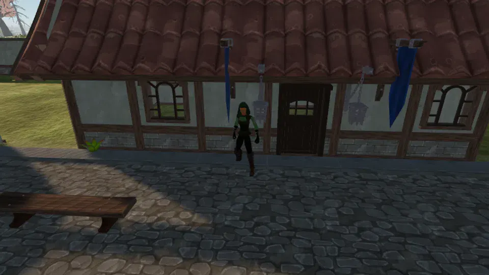

Warden of Millfield. Runs a town on behalf of a company that stopped writing back.

**Found at:** Millfield Square, Farmland

### Quests

_No quest._

## Pitmaster Dorn

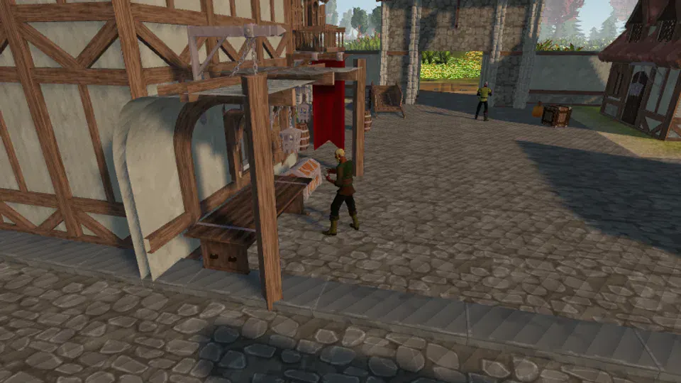

Runs the Copper Pit, and the ledger that says what the Copper Pit contains.

**Found at:** Millfield Square, Farmland

### Quests

- [Dorn's Tally](../quests/dorns_tally/)

## Harrow the Smith

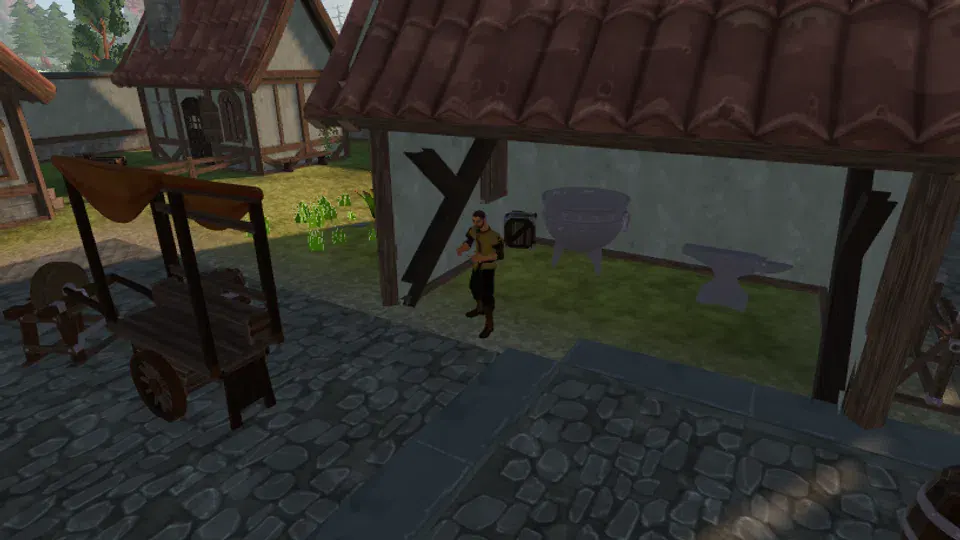

Millfield's smith. Sells metal, teaches the material loop, says very little.

**Found at:** Millfield Square, Farmland

### Quests

- [Cold Iron](../quests/cold_iron/)

## Ranger Syb

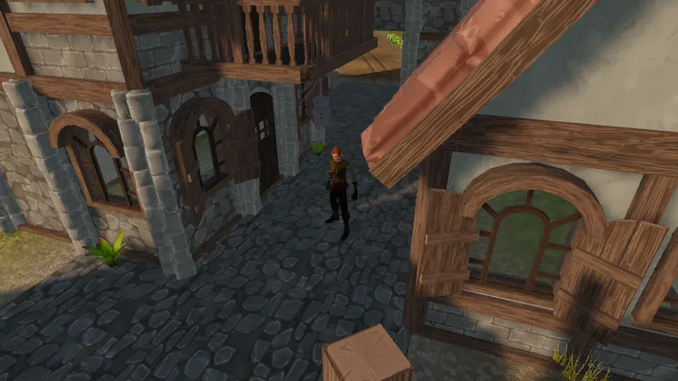

Walks the march and knows where the water is.

**Found at:** Millfield Square, Farmland

### Quests

_No quest._

## Carter Bel

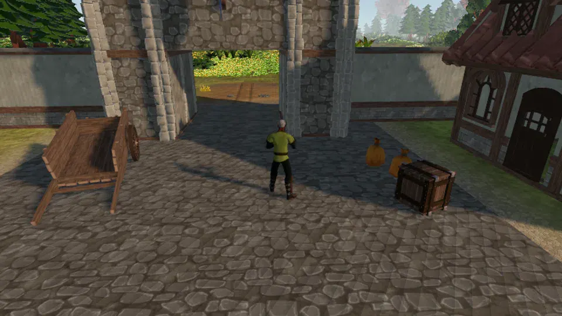

Hauls ore from the pit to the vault. Currently losing an argument to Warden Ilse.

**Found at:** Millfield South Gate, Farmland

### Quests

- [The Carter's Wager](../quests/the_carters_wager/)

## Woodward Ansel

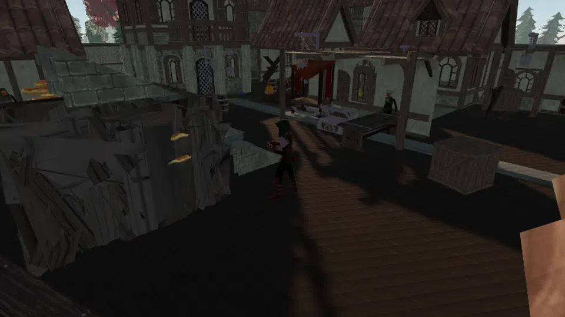

Keeps the Maple Grove. Decides which trees may be felled and which may not.

**Found at:** Oakwood, Woodlands

### Quests

- [Crooked Grain](../quests/crooked_grain/)

## Seamer Juno

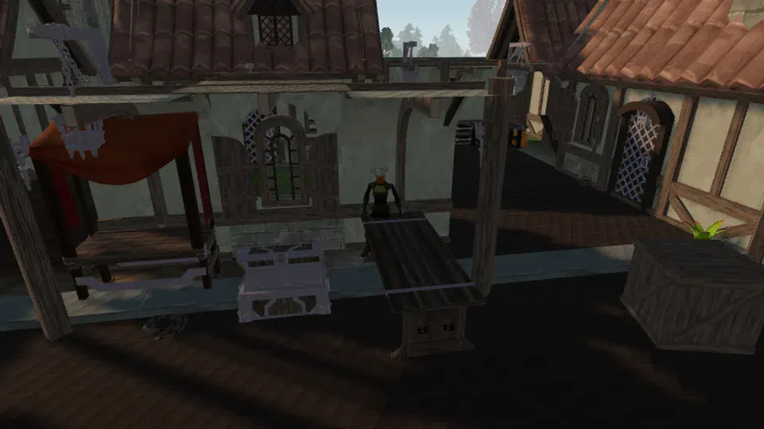

Oakwood's crafter. Shafts, hide, cord, and anything that has to hold under load.

**Found at:** Oakwood, Woodlands

### Quests

- [Knots and Names](../quests/knots_and_names/)

## Trapper Mott

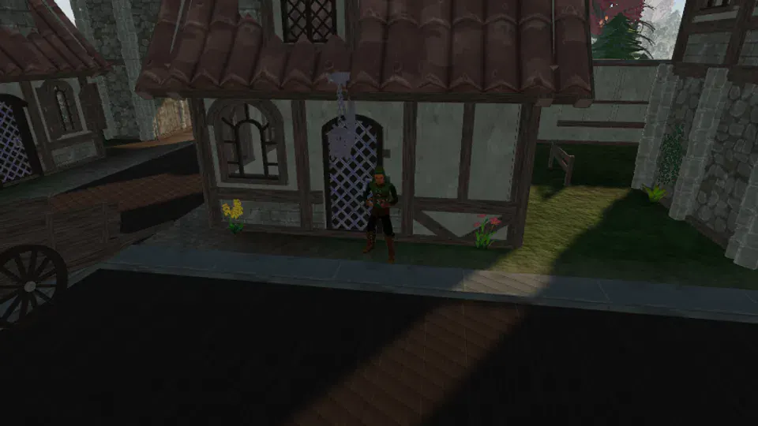

Sets eleven traps in the deep wood. Has caught nothing in eleven days.

**Found at:** Oakwood, Woodlands

### Quests

- [Eleven Empty Days](../quests/eleven_empty_days/)

## Foreman Arden

Foreman of the Hillcrest quarry crew. Stopped the dig six months ago and kept the camp.

**Found at:** Hillcrest, Highlands

### Quests

- [Bad Ground](../quests/bad_ground/)

## Quarrier Vess

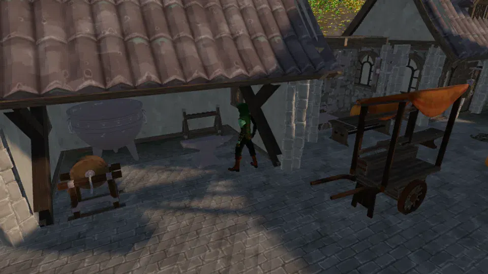

Works the Cobalt faces. Does not like what the blue-black stone does in the dark.

**Found at:** Hillcrest, Highlands

### Quests

- [The Sparking Stone](../quests/sparking_stone/)

## Cairnkeeper Ode

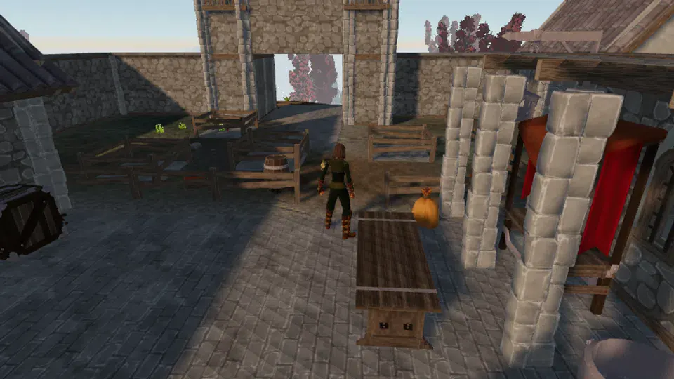

Keeps the cairns on the moor. Nobody appointed her; nobody has argued.

**Found at:** Hillcrest, Highlands

### Quests

- [The Long Cairn](../quests/long_cairn/)

## Watcher Hale

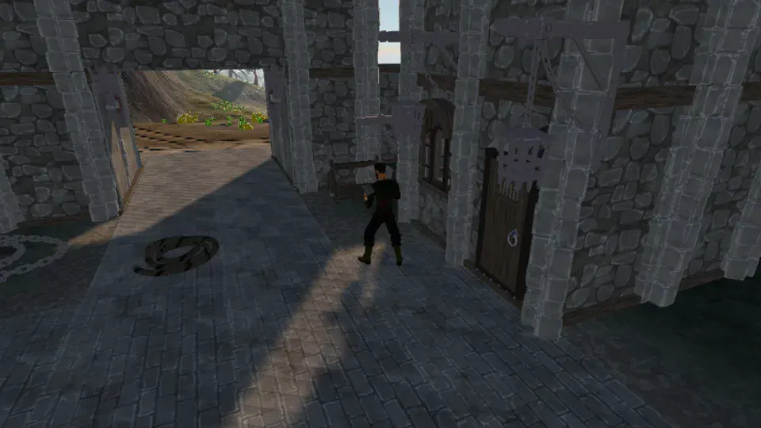

On the rota that watches Stone Cavern mouth. It is his shift more often than it should be.

**Found at:** Hillcrest, Highlands

### Quests

_No quest._
