9 quests. Each card shows who gives it, where it starts, and what it pays.

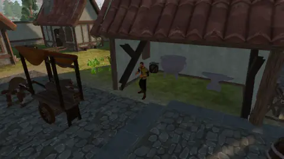Harrow the Smith<a class="codex-card__link" href="./cold_iron/">Cold Iron</a>Millfield Square, FarmlandHarrow the smith will not sell a weapon to somebody who has never made one. Pull Copper out of the Copper Pit, melt it, beat it into a dagger, and go and find out whether it holds.Mining +120Smithing +140Melee +60150 Marks<a class="codex-item-chip" href="../items/grithe_hatchet/">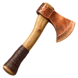<b class="codex-item-chip__count">1×</b>Copper Hatchet</a><a class="codex-item-chip" href="../items/seared_minnow/">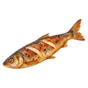<b class="codex-item-chip__count">5×</b>Seared Minnow</a>

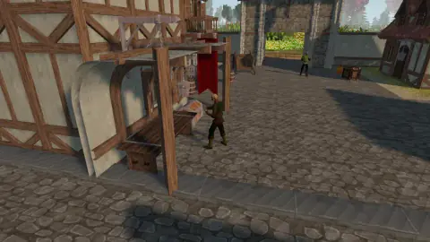Pitmaster Dorn<a class="codex-card__link" href="./dorns_tally/">Dorn's Tally</a>Millfield Square, FarmlandThe Trade Company ledger says a Copper seam is worth four loads. Pitmaster Dorn has been signing that figure for nine years and has never once believed it. Work a seam to the bottom, count what it actually gave, and settle the argument with a number.Mining +260220 Marks<a class="codex-item-chip" href="../items/grithe_pickaxe/">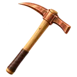<b class="codex-item-chip__count">1×</b>Copper Pickaxe</a>

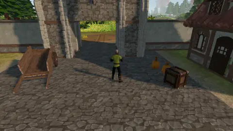Carter Bel<a class="codex-card__link" href="./the_carters_wager/">The Carter's Wager</a>Millfield South Gate, FarmlandCarter Bel has bet Warden Ilse two weeks of cart duty that the pit road is slower than going over things. Warden Ilse has cited three regulations. Carter Bel has cited a cousin.Agility +180260 Marks<a class="codex-item-chip" href="../items/seared_minnow/"><b class="codex-item-chip__count">4×</b>Seared Minnow</a>

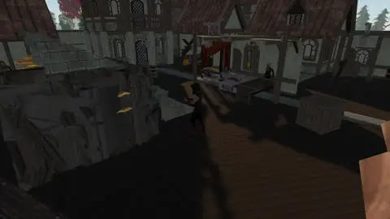Woodward Ansel<a class="codex-card__link" href="./crooked_grain/">Crooked Grain</a>Oakwood, WoodlandsWoodward Ansel will let you take eight ash logs out of his stand. He would like you to understand, first, which one you are not taking.Woodcutting +420400 Marks<a class="codex-item-chip" href="../items/corven_hatchet/">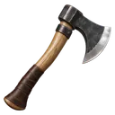<b class="codex-item-chip__count">1×</b>Iron Hatchet</a>

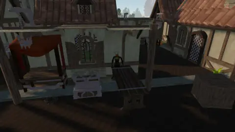Seamer Juno<a class="codex-card__link" href="./knots_and_names/">Knots and Names</a>Oakwood, WoodlandsSeamer Juno makes the parts of things: shafts, cord, hide, and the elemental essence that powers magic weapons. She will teach both trades to anyone who brings her the raw material and does not pretend to already know.Crafting +240Fletching +240300 Marks<a class="codex-item-chip" href="../items/bramblehide_wraps/">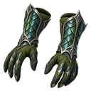<b class="codex-item-chip__count">1×</b>Thick Hide Wraps</a><a class="codex-item-chip" href="../items/air_essence/"><b class="codex-item-chip__count">10×</b>Air Essence</a>

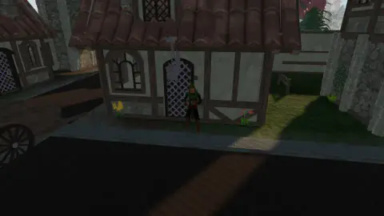Trapper Mott<a class="codex-card__link" href="./eleven_empty_days/">Eleven Empty Days</a>Oakwood, WoodlandsTrapper Mott has eleven traps in the deep wood. In eleven days they have caught eleven nothings. He would like a second opinion, and he would like it delivered gently.Melee +200Agility +120420 Marks<a class="codex-item-chip" href="../items/seared_trout/">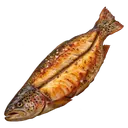<b class="codex-item-chip__count">5×</b>Seared Trout</a>

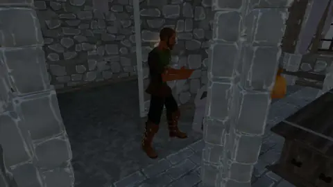Foreman Arden<a class="codex-card__link" href="./bad_ground/">Bad Ground</a>Hillcrest, HighlandsForeman Arden has a crew that stopped digging and a camp that still has to eat. He wants sixteen Cobalt in the Hillcrest vault and he wants to know which way you walked to get it.Mining +900Agility +400900 Marks<a class="codex-item-chip" href="../items/kaldite_pickaxe/">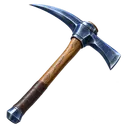<b class="codex-item-chip__count">1×</b>Cobalt Pickaxe</a>

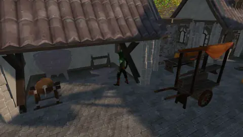Quarrier Vess<a class="codex-card__link" href="./sparking_stone/">The Sparking Stone</a>Hillcrest, HighlandsQuarrier Vess has been cutting Cobalt for nine years and she has never liked what it does in the dark. She would like somebody who is not her to find out what is in it.Magic +700Mining +200700 Marks<a class="codex-item-chip" href="../items/earth_essence/"><b class="codex-item-chip__count">25×</b>Earth Essence</a>

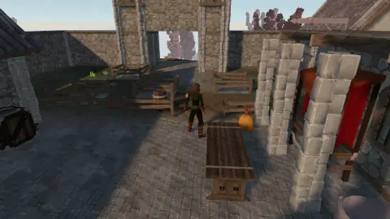Cairnkeeper Ode<a class="codex-card__link" href="./long_cairn/">The Long Cairn</a>Hillcrest, HighlandsSomebody has been re-stacking the cairns on Highlands. Cairnkeeper Ode knows every stone on this moor by name and she did not move them. The line of re-stacked cairns runs from terrace four down the ramps and into a hole the quarry crew stopped digging six months ago.Melee +1,600Magic +600Mining +600Agility +3002,400 Marks<a class="codex-item-chip" href="../items/kaldite_dagger/">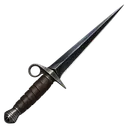<b class="codex-item-chip__count">1×</b>Cobalt Dagger</a><a class="codex-item-chip" href="../items/seared_cragfin/">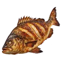<b class="codex-item-chip__count">8×</b>Seared Perch</a>

