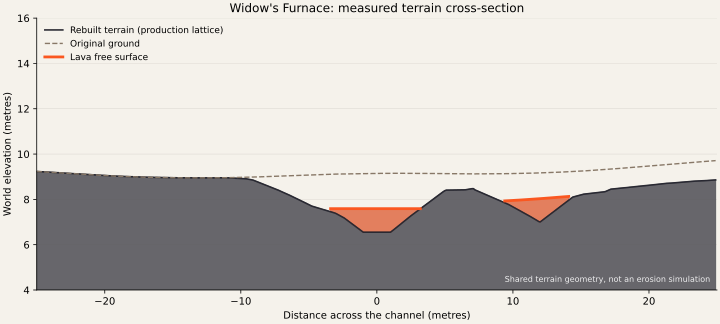

# Lava channels and eroded volcanic terrain

## Design conclusion

The Wilderness needs a volcanic landscape with a legible history. Old lava bodies form the rock substrate; erosion exposes their fractured interiors; new lava follows the resulting low ground and locally builds cooled banks. This is a defensible composite setting, rather than a claim that every visible cliff was excavated by the present flow. Volcanic deposits can occupy existing valleys, and later differential erosion can leave resistant volcanic remnants standing above their surroundings.[^1]

The geological structure must be visible before emission is enabled. A river-shaped luminous ribbon, symmetric banks, and randomly placed stones do not communicate a valley, an eroded rock mass, or a history of overflow. The implementation should establish those large forms first, then place a comparatively quiet lava surface within them. Purple light in the deep Wilderness is an artistic treatment of the same landforms.

## Rivers and lava are different landscape agents

| Process | Evidence and resulting form | Consequence for this terrain |
|---|---|---|
| River incision | Rivers remove and transport material. Bedrock channels depend on substrate properties, sediment supply, and discharge history.[^2] | The valley should have resistant walls, more erodible recesses, and a connected low route. |
| Bedrock plucking | Flow can remove loosened joint blocks; fractures and bedding affect the resulting shapes.[^3] | Exposed faces should contain coherent fracture directions and missing blocks, not only a noisy outline. |
| Abrasion | Moving sediment wears rock; sediment can also shield the bed when it covers it.[^2] | Smooth worn surfaces can occur locally. Making every bank jagged is no more justified than making every bank smooth. |
| Alluvial bend migration | Erosion and deposition create cut banks and inner-bend point bars.[^4] | Asymmetry is useful in an inherited valley, but a sand-river cross-section should not be copied wholesale into lava. |
| Lava confinement | Cooling at lateral boundaries forms stationary margins and levees.[^5] | Some visible banks should be added cooled lava above older ground, not excavated terrain everywhere. |
| Lava overflow | Repeated overflows can build levees and elevate an active channel.[^6] | Use discontinuous, overlapping frozen lobes and local rims. Avoid a continuous decorative curb. |
| Lava erosion | Mechanical erosion has been documented in hot, weak, recently emplaced lava.[^7] | Incised reaches are plausible, but their depth and exposed layers should tell a specific history. |
| Topographic branching | Obstacles can split lava; confinement can bring branches together.[^8] | A split needs a dividing landform, and a merge needs compatible grades and a shared receiving channel. |
| Cooling fractures | Cooling creates joint systems; volcanic exposures can combine ordered columns with irregular entablature.[^9] | Build substantial fractured rock masses. Avoid turning every bank into a regular hexagonal fence. |

## What river erosion actually implies

A drainage basin contains a trunk stream and tributaries separated from other basins by divides. Its channel is part of a larger landform, not an independent line on a flat surface. Channel shape and valley shape are different scales: a modest stream may occupy the floor of a much broader valley.[^10]

Bedrock erosion is not a universal smoothing operation. Field observations show abrasion, plucking, and weathering acting together. Loose fragments are removed during higher flows; the ability of a rock mass to break apart matters as well as the power of the water.[^3] Consequently, convincing volcanic terrain can alternate between short steep faces, recessed fractured zones, and lower aprons. A repeated staircase of identical terraces on both sides is not a substitute for that spatial variation.

The familiar outer cut bank and inner point bar describe sediment-bearing meanders. The USGS Wabash River study relates point-bar architecture to migration, transport, and deposition.[^4] It does not establish a rule that all lava bends must have a tall outside cliff and a low inside shelf. For the Wilderness, a lower inside bench can belong to an older valley, while the new molten channel may have additional frozen margins of its own.

Likewise, a rough edge should follow a plausible rock scale. A fractured slab or ledge should remain identifiable for several metres. Independent jitter at every mesh vertex destroys the relationship between the visible edge, the rock behind it, and the debris below it. The same fracture orientation should appear in a face, a setback in the rim, and nearby fallen fragments. These are design inferences from the erosion mechanisms, not measured laws for this fictional site.

## How lava builds and modifies channels

Lava channels often develop through lateral cooling and concentration of the moving interior.[^5] Their walls can be stationary lava, rather than pre-existing canyon walls. At Kīlauea in 2007, repeated overflows built a perched channel consisting of connected elongated pools. Growth depended on the downstream state: blockage promoted vertical growth, while a breach that lowered the lava level prevented it.[^6]

This matters visually. An active channel, an old overflow apron, and an eroded host-rock wall should not all have the same material, height profile, or edge. A thin cooled lip can sit at the active margin. Behind it, a broad frozen lobe may cover older ground. A separate exposed rock face may rise farther back. In a confined reach these elements overlap; in an open reach the lava can spread without a tall wall on both sides.

USGS imagery from June 2018 identifies shiny gray lobes outside the channel as overflow deposits.[^11] That is a useful reference for subdued, attached shore detail. A broad frozen tongue with a clear attachment to a breach communicates overflow better than evenly spaced boulders. The reference does not justify adding luminous dots or smoke emitters to every channel section.

Lava can also erode its substrate. The Laghetto channel observed during Etna's 2001 eruption was approximately 220 metres long, 8 to 16 metres wide, and up to 6 metres deep. Its banks exposed thin recent lava layers. The authors argued that mechanical wear of still-hot, weak material better explained this particular event than thermal melting alone.[^7] This is relevant to a compact game scene, but it is a documented case with particular conditions, not a general erosion rate or a template for every stream.

The implementation should therefore distinguish an inherited incised valley from a locally constructed levee. It should not explain all relief as instant melting by the visible lava. That distinction allows stronger rock forms without pretending that the active stream excavated a miniature mountain range.

## Routing, splits, and receiving basins

Mapped Hawaiian lava networks include both distributary patterns around obstacles and tributary patterns under topographic confinement. Network changes redistribute supply between branches and affect downstream behaviour.[^8] A natural-looking network therefore needs more than acute junction angles.

Every authored reach should have a clear upstream source, a downstream destination, and a reason for its bends. At a split, a persistent bedrock spur or an older cooled lobe should occupy the dividing ground. Both branch surfaces must descend around it. At a merge, the receiving surface must meet both incoming branches without an upward step or two overlapping lava meshes. A short decorative twig ending on a slope has no such explanation.

Local widening should also have a cause. A confined throat may open into a lower hollow. A flow can pond upstream of an obstruction, or spread and thicken as supply and slope change. Observations of the 2022 Mauna Loa eruption document blockages, backing-up, overflows, and distal stalling and thickening.[^12] For the game, a receiving basin can be an authored broad low area with a partial frozen rim. It should not be a circular bulb attached to a uniform-width line.

Conservation of volume remains a useful constraint even without simulating the eruption. If an incoming flow splits, its supply is divided; the branches should not both inherit the full visual capacity of the parent. If two flows merge, the downstream section must accommodate their combined supply through width, depth, or speed. This is a qualitative authoring check. No numerical effusion rate is claimed for the Wilderness.

## Rock architecture and visual scale

Cooling contraction creates fractures in volcanic rock. Columnar joints are generally oriented relative to cooling surfaces, and irregular entablature can coexist with more ordered colonnades.[^9] USGS descriptions stress that highly fractured entablature can lack an obvious dominant column orientation.[^13]

The useful visual lesson is a connected rock mass with internal structure. A substantial cliff should have a continuous body, a broken crown, recessed fractures, and a grounded toe. Its face can contain differently sized blocks while retaining a common geological direction. Debris should be concentrated below appropriate failures. It should not be distributed as an evenly spaced ornament along both banks.

The intended game scale is restrained: a few rock faces several character-heights tall, lower benches between them, and broader shoulders that visibly redirect the stream. Those dimensions are art and gameplay choices. They are not measurements inferred from the inspiration images. Very tall volcanic peaks, pervasive waterfalls, and an intensely luminous lava lake would change the character and readability of the existing world too far.

## The liquid surface must be independent of the bed

Open-channel lava models distinguish the bed from the free surface and account for flow depth, momentum, and thermal exchange.[^5] A render mesh placed a fixed small distance above every sampled terrain vertex does not make that distinction. It reproduces terrain bumps in the liquid and can lift the lava up its own banks.

The game needs a continuous longitudinal surface grade with a comparatively calm cross-section. The terrain beneath can be deeper, rougher, and asymmetric. A quiet pool needs an approximately common surface elevation. Local accelerations or drops should occur at authored constrictions and steps, not wherever terrain noise happens to change. This is a controlled visual approximation, not a fluid solver.

Standing waves do occur in lava. Measurements and experiments support applying critical-flow concepts to certain fast lava channels.[^14] That evidence is not a reason to add waves everywhere, particularly when the intended presentation is slow, dark lava. Large undulations need a specific location and flow explanation. Most of the visible motion here should come from the crust pattern moving downstream over a stable surface.

Bends also complicate simplistic velocity rules. An analytical Newtonian model predicts asymmetric velocity and crust development, under its stated assumptions.[^15] It should not be generalized into a universal rule that the outside of every lava bend is fastest. The game's simplified current should remain coherent and downstream-directed, while avoiding claims of a calibrated rheological simulation.

## Diagnosis of the existing implementation

The route rebuild improved longitudinal continuity and moved channels away from protected sites, but its landform representation remained inadequate. Each reach was still described primarily by a centreline, a width, and a nearly repeated bank cross-section. Adding width noise altered the outline without creating a geological reason for the outline.

The later bank pass substituted repeated stepped profiles and larger scattered stones. It still lacked substantial host-rock bodies, confined throats, low overflow aprons, and a clear hierarchy between valley, channel, and molten surface. Its silhouette remained a shallow ribbon. The critique that it looked essentially unchanged is consistent with that structural limitation.

Two implementation details compound the problem. The molten geometry samples the same rough ground height used for terrain, then adds a small offset. The animated material offsets world coordinates by a spatially varying velocity multiplied by elapsed time. The first can imprint ground relief on the liquid; the second can accumulate texture distortion where the velocity field changes. These are code-level diagnoses, not findings from the geological literature.

## Application to the Wilderness

The next implementation should separate four related descriptions:

1. **Host landforms.** Authored, connected volcanic rock masses and the valley between them. Their shape must be present in the terrain used for placement and movement.
2. **Channel bed.** A connected descending route with a distinct floor, local constrictions, and meaningful receiving depressions.
3. **Molten surface.** A stable grade above that floor, continuous through joins, with a restrained moving crust pattern.
4. **Deposits and exposed faces.** Cooled levees, occasional attached overflow lobes, fractured wall surfaces, and localized collapse debris.

This is an authored geological-history model. Running an unconstrained erosion simulation on the current terrain would not automatically recover the desired structures, roads, or composition. Conversely, hand-authoring every visible stone without a shared terrain description would reintroduce placement and collision problems. The landforms should have deterministic, inspectable parameters, with reusable rendering proved in the feature lab.

| Existing visual symptom | Required change | Acceptance evidence |
|---|---|---|
| Ribbon floating over softly rolling ground | Separate bed and liquid elevations | Cross-sections and ground-level screenshots show containment without copied terrain waves. |
| Same bank shape on both sides | Author a resistant face on one side and a lower receiving bench where appropriate | A normal gameplay view shows an unmistakable difference in silhouette and use of space. |
| Arbitrary bends and forks | Place rock spurs, confinement, and receiving lows that explain the route | Map and local views agree about why the stream turns or splits. |
| Pebbles used as the primary geology | Build continuous fractured rock bodies with attached toes | The scene remains readable when small dressing is hidden. |
| Uniform bright or duplicate lines | Retain one dark crust pattern and separate shore lighting | The surface stays dark between emissive cracks, without overlapping meshes or added dotted lights. |
| Roughness changes the current direction | Keep bed grade and flow station independent of the shoreline outline | Every intended downstream reach remains descending through joins. |

The shallow and deep Wilderness should share those geometric rules. Warm lava lights the shallow region, and violet lava lights the deeper one. The colour transition should not require a second type of geology. Routes, structures, resources, and roads remain gameplay constraints, and the final navigation and map must be generated from the accepted terrain.

## Implemented terrain revision

The first landform pass introduced sixteen authored volcanic remnants: source shoulders,
confluence dividers, exposed walls, and lower benches. The user subsequently rejected its
repeated silhouettes, pale rims, and flat polygon crowns. The organic-path revision retains
the shared landform descriptions but changes them to broad weathered shoulders with uneven
relief and the surrounding terrain material. Dark bank textures fade into the ground; the
continuous secondary apron and regularly placed bank rocks are gone. The data
is in `game/src/content/wildernessLavaLandforms.ts`; `lavaLandforms.ts` supplies the shared field.
Full-world placement uses the world-authoring exception because the relationship to existing
roads and structures cannot be established in the isolated yard.

The routes also changed: Widow's Furnace has unequal constrictions and a wider receiving reach;
Chainfire splits around a rock island and rejoins downstream; Veilburn has alternating narrow
and broad reaches; Hollow Star's former parallel U-shaped fork now joins the middle of its trunk.
The bypass transport field matches both mouths, and a separate production lab fixture verifies it.

Profiled channels now have a separate liquid elevation above a shaped submerged bed. Their
bed grade stays independent of shoreline irregularity. The material uses fixed longitudinal
transport coordinates, aligning tributaries at the receiving shore, instead of multiplying a
varying velocity field by unbounded elapsed time. It retains one sample of the existing dark
cellular pattern and its emissive orange/violet palette. Invisible area lighting remains separate.
Rock faces receive texture coordinates based on their orientation, avoiding vertical stretching.

The section samples the current production terrain lattice across the middle of Widow's Furnace,
including the nearby seep where the extended section crosses it.
The dashed line is the original ground; the solid outline is the rebuilt bed and host rock.
Orange marks the independently graded liquid. The inputs can be regenerated with
`npx tsx tools/lava-terrain-survey.ts` in `test-results/lava-survey/cross-section.json`;
`python tools/plot-lava-terrain.py` renders the figure (Matplotlib and NumPy required).

The reusable landform, surface and transport paths were exercised in the production deep-lava
fixture before world registration. The fixture checks both palettes, bank illumination with
the sources enabled and disabled, distant lighting, real walking, and collision at the molten
union. Focused tests check the raised host body and cut, independent free surface, downstream
transport, terrain continuity, and protected structure/resource clearances. The terrain survey
checks descending world beds and unchanged road centre lines. Browser screenshots are disposable
under `test-results/deep-wilderness-lava-lab` and `test-results/lava-stream-world`.

Initial technical acceptance on September 10, 2026: the focused lava checks (19 tests), map payload
checks (12 tests), TypeScript check, and production build passed. The production lab and
Widow's Furnace, Veilburn River, and Hollow Star world checks passed real movement and
error checks, and their ordinary follow-camera screenshots were inspected. Navigation was
rebuilt with 4,627 polygons. The full 4,800 by 6,600 world map was recaptured and its exports
validated. The minimap uses 688 by 946 pixels at the existing quality setting to stay within
its 150 KB budget; the full-resolution map remains unchanged in resolution.

This revision establishes the large landforms and contained flow. It does not claim to simulate
an erosion history, and it does not implement every deposit discussed above. In particular,
individually stratified overflow lobes and a calibrated sediment/thermal model remain outside
this implementation. The nine small unprofiled scattered pools retain their legacy bed treatment;
the separate authored liquid grades apply to the main networks and their connected basins.

## Limits of the interpretation

The organic-path revision passed 20 focused lava tests, 12 map payload checks, TypeScript checking, and the production build. Browser acceptance covered the six-channel lab and all four authored world reaches, with normal gameplay screenshots inspected alongside the regenerated map. Navigation was regenerated with 4,342 polygons; the full map remains 4,800 by 6,600 pixels. These checks establish rendering, transport, collision, and artifact consistency, rather than a physical erosion simulation.

The references combine several natural settings. Hawaiian basaltic channels, the unusual Etna erosional example, alluvial river bends, and older exposed volcanic cliffs do not describe one universal landscape. The proposed setting deliberately uses an inherited volcanic valley with a later active flow. That historical interpretation is an artistic choice supported by known processes, not a reconstruction of a real location.

The model does not calculate actual eruption temperatures, effusion rates, cooling times, or erosion duration. It should not claim physical prediction. Scientific evidence is being used to constrain shape, connectivity, material placement, and motion. Acceptance still depends on the actual game view: a larger geological vocabulary in code is insufficient if the terrain looks essentially unchanged.

## Sources

[^1]: National Park Service. [Volcanic Inverted Topography](https://home.nps.gov/articles/000/volcanic-inverted-topography.htm). Explains volcanic deposits occupying lows and subsequent differential erosion.
[^2]: Whipple and colleagues. [Bedrock Rivers](https://sseh.uchicago.edu/doc/Whipple_et_al_2013.pdf), *Treatise on Geomorphology*, 2013. Review of incision, sediment tools and cover, channel form, and erosion thresholds.
[^3]: Stock and colleagues. [Field measurements of incision rates following bedrock exposure](https://www.usgs.gov/publications/field-measurements-incision-rates-following-bedrock-exposure-implications-process), 2005. Field observations of abrasion, plucking, and weathering in exposed bedrock channels.
[^4]: USGS. [The relationship of channel planform and point bar architecture on a reach of the Wabash River near Grayville, Illinois](https://www.usgs.gov/publications/relationship-channel-planform-and-point-bar-architecture-a-reach-wabash-river-near), 2019.
[^5]: [A discontinuous Galerkin finite-element model for fast channelized lava flows v1.0](https://gmd.copernicus.org/articles/14/3553/2021/), *Geoscientific Model Development*, 2021. Distinguishes the free surface, bed, thermal boundaries, and depth-averaged dynamics.
[^6]: Orr, Llewellin, and Patrick. [Development, structure, and behavior of a perched lava channel at Kīlauea Volcano, Hawaiʻi, during 2007](https://www.usgs.gov/publications/development-structure-and-behavior-a-perched-lava-channel-kilauea-volcano-hawaii), *Journal of Volcanology and Geothermal Research*, 2022. DOI: 10.1016/j.jvolgeores.2022.107637.
[^7]: [Lava channel formation during the 2001 eruption on Mount Etna: evidence for mechanical erosion](https://arxiv.org/abs/physics/0512125), 2005 preprint. The Laghetto channel observation and its proposed mechanical origin are case-specific.
[^8]: Dietterich and Cashman. [Channel networks within lava flows: Formation, evolution, and implications for flow behavior](https://agupubs.onlinelibrary.wiley.com/doi/full/10.1002/2014JF003103), *Journal of Geophysical Research: Earth Surface*, 2014. Publisher text was available through indexed excerpts; direct full-page retrieval was restricted.
[^9]: National Park Service. [Columnar Jointing](https://www.nps.gov/subjects/volcanoes/columnar-jointing.htm). Cooling fractures, colonnades, entablature, and exposed examples.
[^10]: National Park Service. [River Systems and Fluvial Landforms](https://www.nps.gov/subjects/geology/fluvial-landforms.htm). Drainage basins, tributaries, channel and floodplain landforms.
[^11]: Hawaiian Volcano Observatory. [Kīlauea Volcano: Lava Channels](https://www.usgs.gov/media/images/kilauea-volcano-lava-channels), June 17, 2018. Public-domain photograph and description of overflow lobes.
[^12]: Dietterich and colleagues. [Lava flow emplacement dynamics during the Mauna Loa 2022 eruption](https://www.usgs.gov/publications/lava-flow-emplacement-dynamics-during-mauna-loa-2022-eruption), *Bulletin of Volcanology*, May 9, 2026. DOI: 10.1007/s00445-026-01980-y.
[^13]: Hawaiian Volcano Observatory. [Columnar jointing provides clues to cooling history of lava flows](https://www.usgs.gov/observatories/hvo/news/volcano-watch-columnar-jointing-provides-clues-cooling-history-lava-flows), 2011.
[^14]: Dietterich, Grant, Fasth, Major, and Cashman. [Can lava flow like water? Assessing applications of critical flow theory to channelized basaltic lava flows](https://www.usgs.gov/publications/can-lava-flow-water-assessing-applications-critical-flow-theory-channelized-basaltic), *Journal of Geophysical Research: Earth Surface*, 2022. DOI: 10.1029/2022JF006666.
[^15]: Valerio, Tallarico, and Dragoni. [Effects of the curvature of a lava channel on flow dynamics and crust formation](https://academic.oup.com/gji/article/187/2/825/574178), *Geophysical Journal International*, 2011. Analytical model with Newtonian, steady-flow assumptions.
