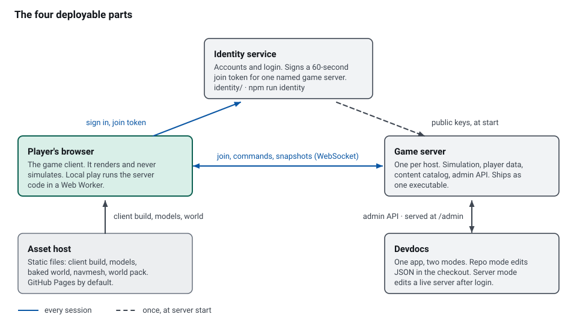
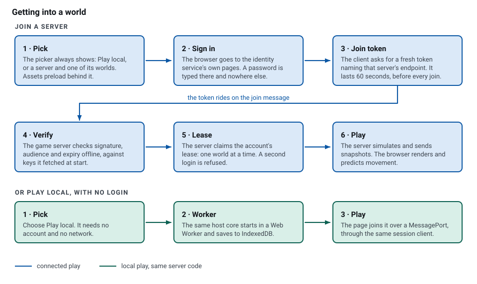
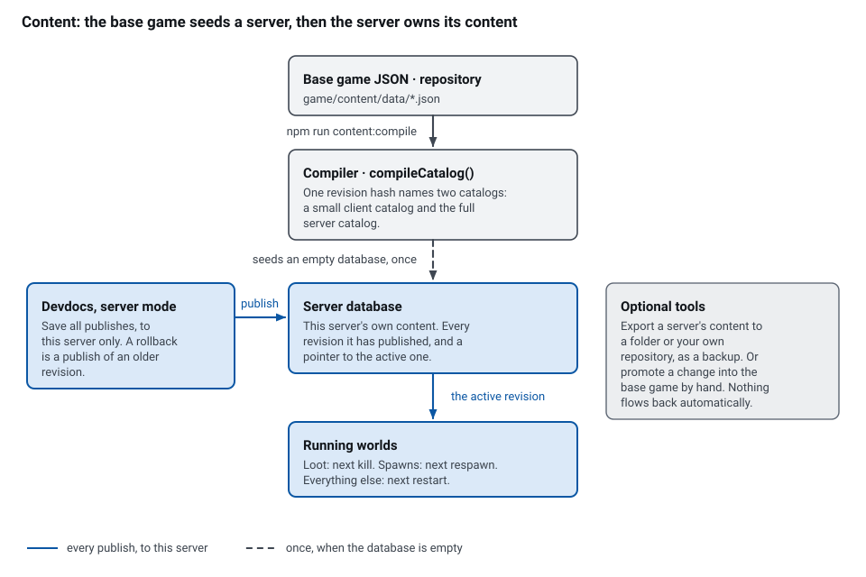
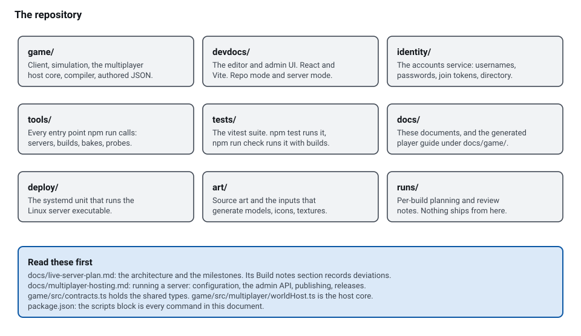
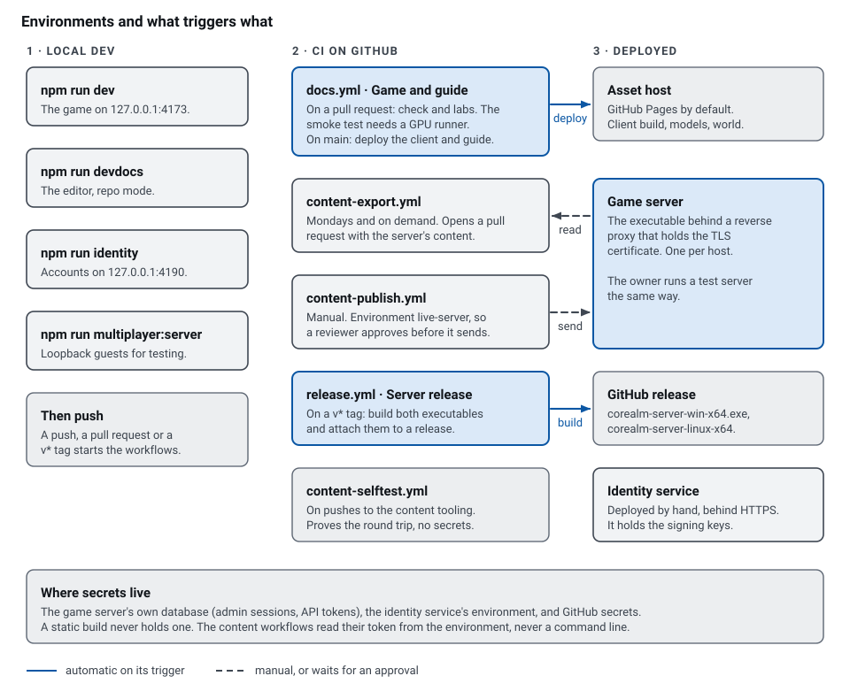

# Corealm for new maintainers

Corealm is a 3D browser game: a Three.js client drawing an authoritative TypeScript simulation. Anyone can host a server from one executable, and a player signs in once and joins any server. Admins edit loot, spawns, creatures and prices in a web editor while the game runs.

This page is the ten-minute tour. Every section links to the document that goes deeper.

## The four parts

<picture><source media="(prefers-color-scheme: dark)" srcset="figures/maintainers/parts-dark.svg"></picture>

| Part | What it owns | Where the code is | How it runs |
| --- | --- | --- | --- |
| Identity service | Accounts, username and password login, the signed join tokens, the public server directory. | `identity/`, entry `tools/identity-server.ts` | `npm run identity`. One per Corealm, behind HTTPS. |
| Game server | Simulation, player characters, the content catalog, roles, bans, the audit log, the admin API. | `game/src/multiplayer/`, entry `tools/multiplayer-server.ts` | One executable per host. Settings in `corealm-server.json`, data in `worlds.sqlite`. |
| Asset host | Static files: the client build, models, textures, the baked world, the navmesh, the world pack. | `game/public/`, built by `npm run build` | GitHub Pages by default. A server names its host in `assetBaseUrl`. |
| Devdocs | The authoring and admin UI. One app, two modes. | `devdocs/` | `npm run devdocs` for repo mode. The game server serves the server-mode build at `/admin/`. |

One host core runs the world: `game/src/multiplayer/worldHost.ts`. The WebSocket server wraps it, and so does local play in a Web Worker, so there is one copy of the game rules.

## How a player gets into a world

<picture><source media="(prefers-color-scheme: dark)" srcset="figures/maintainers/join-dark.svg"></picture>

A password is typed on the identity service's own pages and nowhere else. The game and devdocs send the player there and get a session back in the URL fragment, which a browser never puts in a `Referer` header. Before every join, including each reconnect, the client asks for a fresh join token naming that one server's endpoint.

The game server verifies the token offline, against keys it fetched at start. A join therefore makes no call to the identity service, and a token minted for another server is refused. See [identity service](identity-service.md) and [authentication modes](multiplayer-hosting.md#authentication-modes).

A `player_leases` row holds one account in one world at a time. A second login is refused with `DUPLICATE_LOGIN`. A disconnect saves the character and keeps the place for 30 seconds.

Local play needs no account. The same host core starts in a Web Worker, saves to IndexedDB, and the page joins it over a MessagePort through the same session client. Connected play and local play share one code path.

## How content reaches the game and comes back

<picture><source media="(prefers-color-scheme: dark)" srcset="figures/maintainers/content-dark.svg"></picture>

Authored JSON compiles to two catalogs under one revision hash: a small client catalog the browser may read, and the full server catalog with loot rolls and spawn tables. A live server keeps every revision it has published in its own database and simulates from the active one. The repository's catalog only seeds an empty database. After that the server is the source of truth for its own data, and the repository receives exports.

A publish from devdocs compiles, checks and swaps in one step. Loot applies at the next kill, spawns at the next respawn, and every other table at the next restart. A rollback is a publish of an older revision. Removing an item a player holds, or a creature alive in a world, is refused: mark the definition `retired` instead. See [content authoring](content-authoring.md).

## The repository

<picture><source media="(prefers-color-scheme: dark)" srcset="figures/maintainers/repo-dark.svg"></picture>

## Environments and pipelines

<picture><source media="(prefers-color-scheme: dark)" srcset="figures/maintainers/pipelines-dark.svg"></picture>

The owner also runs a test server on their own machine: the same executable behind a TLS proxy.

Secrets live in three places: the game server's own database, the identity service's environment, and GitHub secrets. A static build never holds one. The publish workflow keeps its token in the `live-server` environment, so a reviewer has to approve before it can be read. Both content tools read the token from `COREALM_CONTENT_TOKEN` and refuse a `--token` flag, because a command line is visible to every other process on the machine.

## Day to day

| I want to | Command, or where | Read |
| --- | --- | --- |
| Run the game | `npm run dev` | [feature-lab.md](feature-lab.md) |
| Run the editor | `npm run devdocs` | [content-authoring.md](content-authoring.md) |
| Run a server locally | `npm run multiplayer:server -- --authored --development-guests --port 4180 --data ./local-worlds` | [multiplayer-hosting.md](multiplayer-hosting.md#run-locally) |
| Run accounts locally | `npm run identity -- --origins http://127.0.0.1:4173` | [identity-service.md](identity-service.md#configuration) |
| Edit content | Devdocs, then **Save all** | [content-authoring.md](content-authoring.md#the-save-cycle) |
| Publish repo content to a live server | The **Content publish** workflow, or `npm run content:publish:server -- --server <url> --confirm "<server name>"` | [content workflows](multiplayer-hosting.md#content-workflows-and-their-secrets) |
| Export a live server into the repo | The **Content export** workflow, or `npm run content:export:server -- --server <url> --dry-run` | [content workflows](multiplayer-hosting.md#content-workflows-and-their-secrets) |
| Rebake the world | `npm run world:build` | [server world pack](world-authoring.md#server-world-pack) |
| Run the gates | `npm run check`, then `npm run smoke -- --run runs/corealm --hardware` | [feature-lab.md](feature-lab.md#everyday-commands) |
| Build the server executables | `npm run devdocs:build:server`, then `npm run server:build` | [building the executables](multiplayer-hosting.md#building-the-executables) |
| Cut a release | Push a `v*` tag. `release.yml` builds and attaches both executables. | [releases](multiplayer-hosting.md#releases) |
| Give someone admin | Devdocs, **Server → Access**. Only an owner may grant a role. | [roles, bans, and tokens](multiplayer-hosting.md#roles-bans-and-tokens) |
| Kick or ban a player | Devdocs, **Players**, beside the name. A kick saves the character; a ban needs a reason. | [kicking a player](multiplayer-hosting.md#kicking-a-player) |
| Roll back content | Devdocs, **Server → Publishes → Roll back** | [publishing content](multiplayer-hosting.md#publishing-content) |
| Reset a player's password | On the identity service host: `npx tsx tools/identity-admin.ts --data identity-data set-password <name>`. A player who still knows theirs changes it on the service's own `/password` page. | [the operator tool](identity-service.md#the-operator-tool) |

## Rules that bite

- Node 24, nothing else. `.node-version` and the `engines` field both pin it.
- An edit under `game/src` or `game/content/data` stales the baked world. Run `npm run world:build` before the gates, or `tests/world-release-artifact.test.ts` fails.
- Content schemas use the hand-rolled combinators in `game/src/content/schema/core.ts`. Do not add zod or another schema library.
- The server takes no native dependency. One would break the single executable build.
- The devdocs UI is Tailwind and the shadcn kit that is already in the app. Write no hand CSS.
- The client build enforces gzip budgets in `game/vite.config.ts`. Keep server-only code and catalog tables out of the client bundle and out of the worker.
- Parse and validate every external input at the boundary: join messages, admin API bodies, configuration files and tokens.
- The game is pre-v1. Delete a retired path and its callers instead of leaving a compatibility shim.

## Status

| Milestone | What it added | State |
| --- | --- | --- |
| M1 to M3 | The configuration file, the asset base URL, the identity service, server accounts, the players table and the lease. | Done |
| M4 | The catalog in the server database, live publish and rollback. | Done |
| M5 | Devdocs server mode, the players and server workspaces. | Done |
| M6 | The baked server world pack and the two single executables. | Done |
| M7 | Thin client, local play in a Web Worker. | In progress |
| M8 | The CI content workflows. | Done |
| M9 | A worker thread per world. | Not started |

## Where to read more

- [live-server-plan.md](live-server-plan.md): the architecture and the milestones. Its **Build notes** section records where the code went another way.
- [live-server-m7-stages.md](live-server-m7-stages.md): the working plan for the milestone in progress.
- [multiplayer-hosting.md](multiplayer-hosting.md): configuration, the admin API, publishing, the executable, releases.
- [identity-service.md](identity-service.md): accounts, join tokens, key rotation, the server directory.
- [content-authoring.md](content-authoring.md): the two catalogs, the save cycle, repo mode against server mode.
- [world-authoring.md](world-authoring.md): the authored world, and the server world pack the game server boots from.
- [architecture.md](architecture.md): the host core, worker local play and the storage rules.
- [feature-lab.md](feature-lab.md): the development loop and which check to run.
- [AGENTS.md](../AGENTS.md): the rules agents working in this repository follow.
